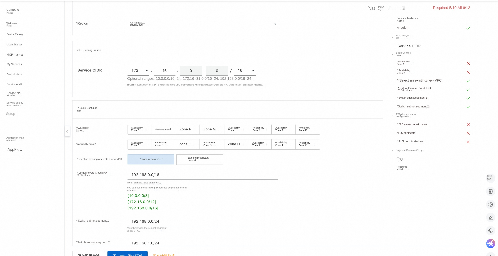
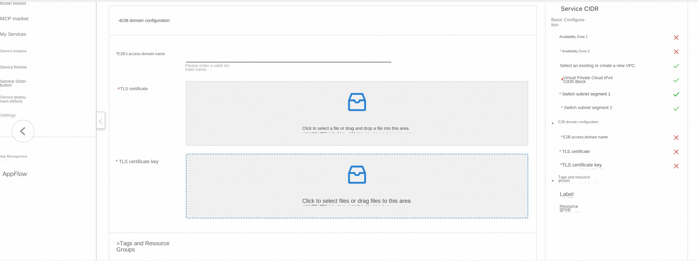
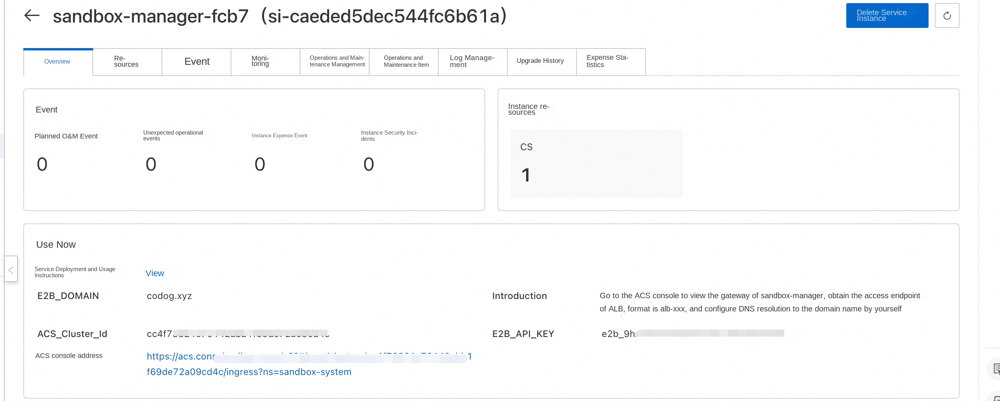
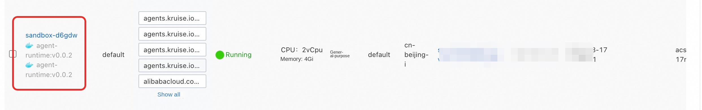
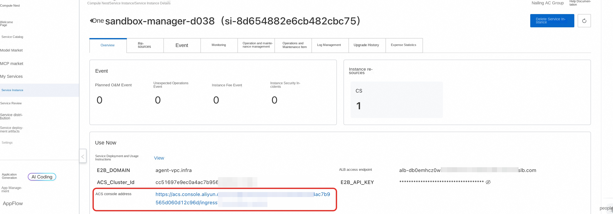
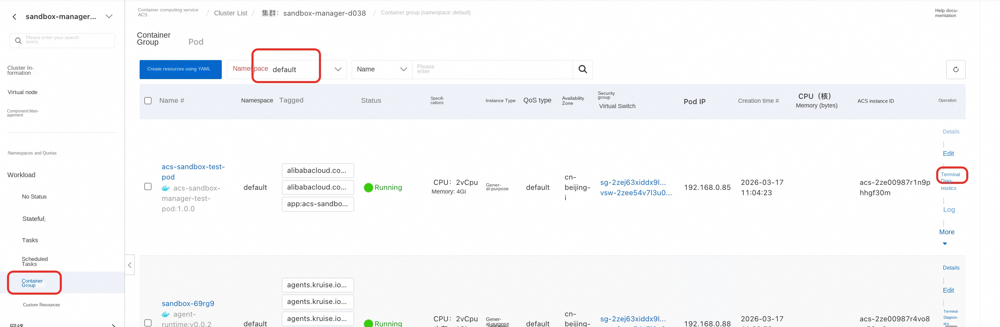
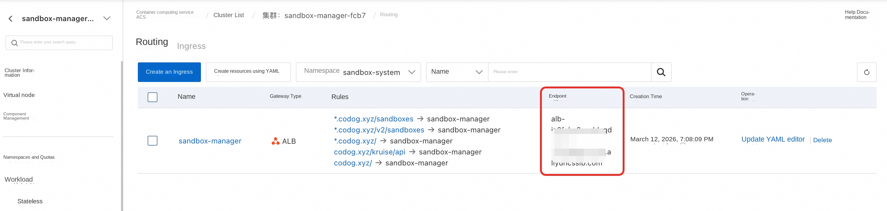
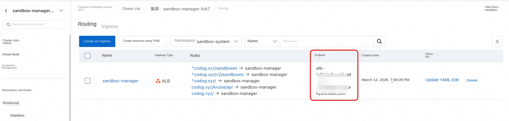
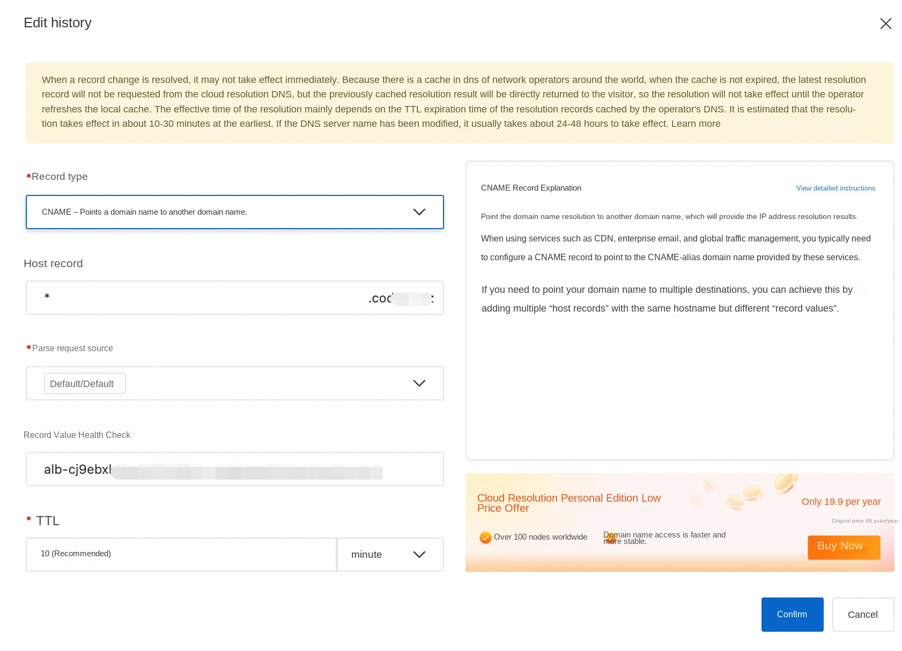

# Using E2B to Manage Secure Sandboxes in an ACS Cluster

## Overview

E2B is a popular open-source secure sandbox framework that provides a simple and easy-to-use Python and JavaScript SDK. These SDKs enable users to create and query sandboxes, execute code, request ports, and perform other operations. The ack-sandbox-manager component is a backend application that is compatible with the E2B protocol. It enables users to quickly deploy, with a single click, a sandbox infrastructure in any Kubernetes cluster that delivers performance comparable to native E2B.

This service provides a quick solution for deploying secure sandboxes in an ACS cluster and supports interaction using the E2B protocol.

## Prerequisites

The standard E2B protocol requires a domain name (E2B_DOMAIN) to specify the backend service. To do this, you need to prepare your own domain name. The E2B client must communicate with the backend over HTTPS, so a wildcard certificate also needs to be obtained for the service.

The following describes the steps for preparing the domain name and certificates in the test environment. The generated fullchain.pem and privkey.pem files will be used in subsequent deployment stages.

### Prepare the Domain Name

* In the test environment, you can use a test domain name for ease of verification, such as the example: agent-vpc.infra.

### Obtain a Self-Signed Certificate

Create a self-signed certificate using the script [generate-certificate.sh](https://github.com/openkruise/agents/blob/master/hack/generate-certificates.sh). You can view the script’s usage instructions by running the following command.

plaintext
$bash generate-certificates.sh --help

Usage: generate-certificates.sh [OPTIONS]

Options:
-d, --domain DOMAIN Specify certificate domain (default: your.domain.com)
-o, --output DIR Specify the output directory (default: .)
-D, --days DAYS Specify certificate validity days (default: 365)
-h, --help Show this help message

Examples:
generate-certificates.sh -d myapp.your.domain.com
generate-certificates.sh --domain api.your.domain.com --days 730
'''

Example command for generating a certificate:

plaintext
./generate-certificates.sh --domain agent-vpc.infra --days 730
'''

After the certificate is generated, you will obtain the following files:

* fullchain.pem: server certificate public key

* privkey.pem: server certificate private key

* ca-fullchain.pem: CA certificate public key

* ca-privkey.pem: CA certificate private key. This script generates both a single-domain certificate (your.domain) and a wildcard certificate (*.your.domain), and is compatible with both the native E2B protocol and the OpenKruise-customized E2B protocol.

## Deployment Process

1. Open the Compute Nest service [deployment link](https://computenest.console.aliyun.com/service/instance/create/cn-hangzhou?type=user&ServiceId=service-47d7c54c78604e0bbe79)

2. Fill in the relevant deployment parameters, select the deployment region, the Service CIDR of the ACS cluster, and the VPC configuration.

3. Fill in the E2B domain configuration. Configure the E2B access domain name as the domain name specified in the prerequisites preparation stage mentioned above.

1. For the TLS certificate, select the fullchain.pem file.

2. Select the TLS certificate private key file: privkey.pem

4. An E2B_API_KEY will be generated for accessing the E2B API.

5. The sandbox-manager component’s default CPU and memory configuration is 2 cores and 4 GiB of memory, which can be adjusted as needed.

6. After completing the configuration, click Confirm Order.

7. After successful deployment, you can also view information such as E2B_API_KEY and E2B_DOMAIN on the service instance details page.

## OpenClaw Sandbox Definition Explanation

By default, the computing nest uses the following yaml to create a single-copy SandboxSet preheating pool (equivalent to an e2b template). If you build a mirror later, you can directly replace the containers mirror in the cluster. In order to improve the pulling speed, it can also be replaced with an intranet mirror: registry-${RegionId}

'''yaml
aapiVersion: agents.kruise.io/v1alpha1
kind: SandboxSet
metadata:
name: sandbox
namespace: default
annotations:
e2b.agents.kruise.io/should-init-envd: "true"
labels:
app: sandbox
spec:
persistentContents:
-filesystem
replicas: 1
template:
metadata:
labels:
alibabacloud.com/acs: "true"# Use ACS computing power
app: sandbox
annotations:
"true"# supports pause
spec:
restartPolicy: Always
automountServiceAccountToken: false #Pod does not mount service account
enableServiceLinks: false #Pod does not inject service environment variables
initContainers:
-name: init
image: registry-cn-hangzhou.ack.aliyuncs.com/acs/agent-runtime:v0.0.2
imagePullPolicy: IfNotPresent
command: [ "sh", "/workspace/entrypoint_inner.sh"]
volumeMounts:
-name: envd-volume
mountPath: /mnt/envd
env:
-name: ENVD_DIR
value: /mnt/envd
-name: __IGNORE_RESOURCE __
value: "true"
restartPolicy: Always
containers:
-name: sandbox
image: registry-cn-hangzhou.ack.aliyuncs.com/acs/agent-runtime:v0.0.2
imagePullPolicy: IfNotPresent
securityContext:
readOnlyRootFilesystem: false
runAsGroup: 0
runAsUser: 0
resources:
requests:
cpu: 2
memory: 4Gi
limits:
cpu: 2
memory: 4Gi
env:
-name: ENVD_DIR
value: /mnt/envd
volumeMounts:
-name: envd-volume
mountPath: /mnt/envd
startupProbe:
tcpSocket:
port: 49983
initialDelaySeconds: 5
periodSeconds: 5
failureThreshold: 30
lifecycle:
postStart:
exec:
command: [ "/bin/bash", "-c", "/mnt/envd/envd-run.sh"]
terminationGracePeriodSeconds: 30# can be adjusted according to the actual exit speed
volumes:
-emptyDir: {}
name: envd-volume
'''

**Important Field Description**

* SandboxSet.spec.persistentContents: filesystem# During pause and connect, only the filesystem is preserved (IPs and memory are not).

* template.spec.restartPolicy: Always

* template.spec.automountServiceAccountToken: false# Pods do not mount the service account

* template.spec.enableServiceLinks: false# Do not inject service environment variables into the Pod

* template.metadata.labels.alibabacloud.com/acs: "true"

* template.metadata.annotations.ops.alibabacloud.com/pause-enabled: "true"# Supports pause and connect actions

* template.spec.initContainer# Download and copy the Envs environment; keep as is.

* template.spec.initContainers.restartPolicy: Always

* template.spec.containers.securityContext.runAsNonRoot: true# Start the Pod as a non-root user

* template.spec.containers.securityContext.privileged: false# Disable privileged mode

* template.spec.containers.securityContext.allowPrivilegeEscalation: false

* template.spec.containers.securityContext.seccompProfile.type.RuntimeDefault

* template.spec.containers.securityContext.capabilities.drop: [ALL]

* template.spec.containers.securityContext.readOnlyRootFilesystem: false

If you anticipate using Pause, do not configure liveness or readiness probes to avoid health check issues during the pause. Make necessary adjustments.

* registry-cn-hangzhou.ack.aliyuncs.com/acs/agent-runtime# Change this to the image for your region, and make sure it’s an internal network image [Currently, this will be automatically injected in the future]

Brief explanation of the mechanism: The server-side API of the e2b SDK is supported by launching envd within the pod.

Create the aforementioned resources using kubectl. After the SandboxSet is created, you will see that one sandbox is already in the Available state:

# Service deployment verification

After deployment is complete, you will obtain a corresponding ACS cluster. Within the ACS cluster, under the sandbox-system namespace, there is a Deployment named sandbox-manager that is used to manage sandboxes. Verify that the E2B service is running properly by following the steps below, and then walk through a sandbox demo.

This part is divided into automated testing and manual testing. One of the test steps can be selected to verify the core functions. The two test methods verify the same functions and both include sandbox creation, hibernation and reconnection.

## Automated testing
1. Click the computing nest service instance to find the acs cluster contained in the instance.
2. Click the cluster container group interface, find the acs-test-pod, and click the terminal login
3. Execute python test_sandbox.py
4. Wait for the script to verify that all features pass.

## Manual test (optional)
### Configure Domain Name Resolution
#### Local Host Configuration: For Quick Verification

1. Obtain the ALB access endpoint: In the ack-sandbox-manager cluster, an ALB is used as the Ingress. On the service instance details page, you can find a link to the ACS console. Click the link to view the sandbox-manager gateway, which will display the ALB access endpoint, as shown in the figure below.

2. Obtain the public IP address corresponding to the ALB endpoint: On your local machine, ping the ALB’s access endpoint to retrieve the public IP address using the command ‘ping alb-xxxxxx’.

3. Configure the ALB’s public IP address and domain name in your local hosts file: ‘echo "ALB_PUBLIC_IP api.E2B_DOMAIN" >> /etc/hosts’. For example: ‘xx.xxx.xx.xxx api.agent-vpc.infra’.

4. After configuring the Host, you do not need to set up DNS resolution. You can manage the E2B sandbox locally. For detailed instructions, refer to the “Using the Sandbox Demo” section.

#### Configure DNS Resolution: For Production Environment

1. Obtain the ALB access endpoint: In the ack-sandbox-manager cluster, an ALB is used as the Ingress. On the service instance details page, you can find a link to the ACS console. Click this link to view the sandbox-manager gateway, which will display the ALB access endpoint, as shown in the figure below

2. Configure DNS resolution: Please resolve the ALB’s access endpoint to the corresponding domain name using a CNAME record.

3. If internal network access is required, you can use PrivateZone to add an internal domain name for E2B. (If you selected to create a new VPC during deployment, PrivateZone has already been automatically configured for you; you only need to add DNS records afterward.) [Optional]

Replace xxxxx with the domain name you specified earlier. A 2xx response code indicates that the e2b service is running. If you are using a self-signed certificate, you need to specify ca-fullchain.pem; alternatively, you can use your local certificate by configuring environment variables. [This action is part of the sandbox creation process.] For the e2b key, please replace “admin-987654321” with your actual key.

yaml
curl --cacert fullchain.pem -X POST --location "https://api.agent-vpc.infra/sandboxes" \
-H "Content-Type: application/json" \
-H "X-API-Key: admin-987654321" \
-d '{
"templateID": "sandbox ",
"timeout": 300
}'
'''

When the JSON response contains a "sandboxID" field and the "state" is "running", it can be considered that the e2b service is up and running.

### Create a sandbox using the e2b SDK

python
from e2b_code_interpreter import Sandbox

sbx = Sandbox.create(
template="sandbox ",
request_timeout=60,
metadata={
“e2b.agents.kruise.io/never-timeout”: “true”# Never expires, does not automatically kill
}
)
r = sbx.commands.run("whoami")
print(f"Running in sandbox as \"{r.stdout.strip()}\"")
'''

### Hibernation Wake-Up Test Code

yaml
Write the following file to test_sandbox.py

import time
from dotenv import load_dotenv
from e2b_code_interpreter import Sandbox

def main():
print("Hello from acs-sandbox-test!)
load_dotenv(override=True)

# Step 1: Create a sandbox
print("\n[Step 1] Creating sandbox...")
start_time = time.monotonic()
sandbox = Sandbox.create('sandbox', timeout=1800)
print(f"Sandbox creation took: {time.monotonic() - start_time:.2f} seconds")
print(f"Sandbox ID: {sandbox.sandbox_id}")
print(f"envd host: {sandbox.get_host(49983)}")

# Step 2: Pause sandbox
print("\n [Step 2] Perform sandbox beta_pause...")
start_time = time.monotonic()
pause_success = sandbox.beta_pause()
print(f"pause duration: {time.monotonic() - start_time:.2f} seconds")
print(f"pause success: {pause_success}")

print("Wait 60 seconds for the sandbox to pause completely...")
time.sleep(60)

# Step 3: resume and verify file persistence
print("\n [Step 3] Reconnect sandbox(resume)...")
start_time = time.monotonic()
same_sandbox = sandbox.connect(timeout=180)
print(f "connect time: {time.monotonic() - start_time:.2f} seconds")
print(f "Reconnect succeeded. Sandbox ID: {same_sandbox.sandbox_id}")

print("\nAll steps have been completed!)

if __name__ == "__main__":
main()
'''
