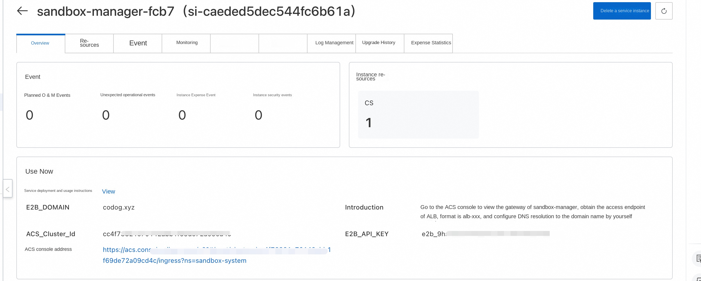
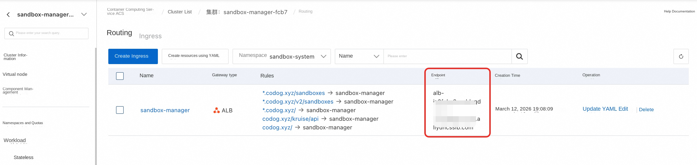
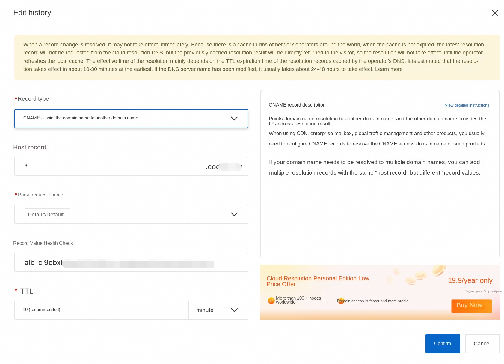

# Use E2B to manage security sandbox in ACS cluster

## Overview

E2B is a popular open source security sandbox framework that provides a simple and easy-to-use Python and JavaScript SDK for users to create, query, execute code, and request ports on security sandboxes. The ack-sandbox-manager component is a backend application compatible with the E2B protocol, enabling users to build a sandbox infrastructure with performance comparable to that of native E2B in any K8s cluster.

This service provides a solution for quickly building a security sandbox in an ACS cluster and supports interaction using the E2B protocol.

## Pre-preparation

The standard E2B protocol requires a domain name (E2B\_DOMAIN) to specify the backend service. To do this, you need to prepare your own domain name. The E2B client must request the backend through the HTTPS protocol, so it also needs to apply for a wildcard certificate for the service.

The following describes the steps for preparing domain names and certificates in the test scenario. The generated fullchain.pem and privkey.pem files will be used in the subsequent deployment phase.

### Prepare Domain Name

* In the test scenario, to facilitate verification, you can use the test domain name, for example: agent-vpc.infra.

### Obtaining a Self-Signed Certificate

The script [generate-certificate.sh](https://github.com/openkruise/agents/blob/master/hack/generate-certificates.sh) creates a self-signed certificate. You can use the following command to view how the script is used.

'''plaintext
$bash generate-certificates.sh --help

Usage: generate-certificates.sh [OPTIONS]

Options:
-d, --domain DOMAIN Specify certificate domain (default: your.domain.com)
-o, --output DIR Specify output directory (default: .)
-D, --days DAYS Specify certificate validity days (default: 365)
-h, --help Show this help message

Examples:
generate-certificates.sh -d myapp.your.domain.com
generate-certificates.sh --domain api.your.domain.com --days 730
'''

Example of a command to generate a certificate:

'''plaintext
./generate-certificates.sh --domain agent-vpc.infra --days 730
'''

After the certificate generation is complete, you will get the following file:

* fullchain.pem: server certificate public key

* privkey.pem: Server certificate private key

* ca-fullchain.pem:CA certificate public key

* ca-privkey.pem:CA certificate private key This script generates both single domain name (your.domain) and wildcard domain name (\*.your.domain) certificates, which is compatible with the native E2B protocol and OpenKruise custom E2B protocol.

### Activate Service
If you have not used the relevant cloud service before, you will be prompted to activate the service and create the corresponding service role during deployment, as shown in the following figure,

The permissions required in this step are relatively risky (the administrator permissions of the cloud product are required). We recommend that you use the following two methods to activate:
Note: opening is a one-time operation, and only needs to be opened during the first operation.
1. Contact a user with administrator rights to open the computing nest service deployment link, and let the administrator user open it according to the prompt.
2. Contact a user with administrator permissions to temporarily grant administrator permissions to the RAM user. After the RAM user is authorized, it can be activated. The required permissions are as follows.
Policy:[open_policy.json](https://github.com/aliyun-computenest/openclaw-acs-sandbox/blob/main/docs/open_policy.json)

### Authorize RAM users

If you are using a RAM user, you must authorize the RAM user to complete the deployment process. For more information, see [Authorization Document](https://help.aliyun.com/zh/compute-nest/security-and-compliance/grant-user-permissions-to-a-ram-user).

The permission policies required to deploy this service include two system permission policies and one custom permission policy. Contact a user with administrator permissions to grant the following permissions to the RAM user:
**System Permission Policy:**
-AliyunComputeNestUserFullAccess: Manage user-side permissions for the compute nest service (ComputeNest),
-AliyunROSFullAccess: Manage permissions for the Resource Orchestration Service (ROS).
**Custom permissions policy:**
-Permission policy:[policy.json](https://github.com/aliyun-computenest/quickstart-Sandbox-Manager-E2B/blob/main/docs/policy.json)

## Deployment process

1. Open the compute nest service [deployment link](https://computenest.console.aliyun.com/service/instance/create/cn-hangzhou?type=user&ServiceId=service-47d7c54c78604e0bbe79)

2. Fill in the relevant deployment parameters, select the deployment region, Service CIDR of the ACS cluster, and configure the VPC

3. Fill in the E2B domain name configuration. The E2B access domain name is configured as the domain name in the preparation stage of the above premise,

1. TLS certificate selection fullchain.pem file

2. TLS certificate private key selection privkey.pem file

4. E2B\_API\_KEY will be generated to access E2B API

5. sandbox-The default CPU and memory configuration of manager components defaults to 2C and 4Gi, which can be adjusted as needed

6. After the configuration is completed, click Confirm Order

7. After the deployment is successful, you can also view E2B\_API\_KEY, E2B\_DOMAIN and other information on the details page of the service instance.

## OpenClaw sandbox definition description

By default, the computing nest uses the following yaml to create a single-copy SandboxSet preheating pool (equivalent to an e2b template). If you build a mirror later, you can directly replace the containers mirror in the cluster. In order to improve the pulling speed, it can also be replaced with an intranet mirror: registry-${RegionId}

yaml
aapiVersion: agents.kruise.io/v1alpha1
kind: SandboxSet
metadata:
name: sandbox
namespace: default
annotations:
e2b.agents.kruise.io/should-init-envd: "true"
labels:
app: sandbox
spec:
persistentContents:
-filesystem
replicas: 1
template:
metadata:
labels:
alibabacloud.com/acs: "true"# Use ACS computing power
app: sandbox
annotations:
"true"# supports pause
spec:
restartPolicy: Always
automountServiceAccountToken: false #Pod does not mount service account
enableServiceLinks: false #Pod does not inject service environment variables
initContainers:
-name: init
image: registry-cn-hangzhou.ack.aliyuncs.com/acs/agent-runtime:v0.0.2
imagePullPolicy: IfNotPresent
command: [ "sh", "/workspace/entrypoint_inner.sh"]
volumeMounts:
-name: envd-volume
mountPath: /mnt/envd
env:
-name: ENVD_DIR
value: /mnt/envd
-name: __IGNORE_RESOURCE __
value: "true"
restartPolicy: Always
containers:
-name: sandbox
image: registry-cn-hangzhou.ack.aliyuncs.com/acs/agent-runtime:v0.0.2
imagePullPolicy: IfNotPresent
securityContext:
readOnlyRootFilesystem: false
runAsGroup: 0
runAsUser: 0
resources:
requests:
cpu: 2
memory: 4Gi
limits:
cpu: 2
memory: 4Gi
env:
-name: ENVD_DIR
value: /mnt/envd
volumeMounts:
-name: envd-volume
mountPath: /mnt/envd
startupProbe:
tcpSocket:
port: 49983
initialDelaySeconds: 5
periodSeconds: 5
failureThreshold: 30
lifecycle:
postStart:
exec:
command: [ "/bin/bash", "-c", "/mnt/envd/envd-run.sh"]
terminationGracePeriodSeconds: 30# can be adjusted according to the actual exit speed
volumes:
-emptyDir: {}
name: envd-volume
'''

**Important Field Description**

* SandboxSet.spec.persistentContents: filesystem# Only the file system is retained during pause and connect (ip and mem are not retained)

* template.spec.restartPolicy: Always

* template.spec.automountServiceAccountToken: false #Pod does not mount service account

* template.spec.enableServiceLinks: false #Pod does not inject service environment variables

* template.metadata.labels.alibabacloud.com/acs: "true"

* "true"# Support pause, connect action

* template.spec.initContainer# download and copy envd environment, and keep it

* template.spec.initContainers.restartPolicy: Always

* template.spec.containers.securityContext.runAsNonRoot: true #Pod started with normal user

* template.spec.containers.securityContext.privileged: false# Disable privilege configuration

* template.spec.containers.securityContext.allowPrivilegeEscalation: false

* template.spec.containers.securityContext.seccompProfile.type.RuntimeDefault

* template.spec.containers.securityContext.capabilities.drop: \[ALL\]

* template.spec.containers.securityContext.readOnlyRootFilesystem: false

If you expect to use Pause, be sure not to set up liveness/rediness probes to avoid necessary modifications to health check issues during the pause.

* Modify the mirror image of the region where it is located, and it is an intranet mirror image [currently, it will be automatically injected in the future]]

the brief description of the mechanism supports the server interface of the e2b sdk by starting the envd in the pod.

Create the preceding resource by kubectl. After the SandboxSet is created, you can see that one sandbox is available:

# Service deployment verification

After the deployment is complete, an ACS cluster is created. In the ACS cluster, there is a sandbox-manager Deployment under the sandbox-system namespace to manage the sandbox. Use the following procedure to verify that the E2B service is running normally, and introduce the use of the demo in the sandbox.

This part is divided into automated testing and manual testing. One of the test steps can be selected to verify the core functions. The two test methods verify the same functions and both include sandbox creation, hibernation and reconnection.

## Automated testing
1. Click the computing nest service instance to find the acs cluster contained in the instance.
2. Click the cluster container group interface, find the acs-test-pod, and click the terminal login
3. Execute python test_sandbox.py
4. Wait for the script to verify that all features pass.

## Manual test (optional)
### Configure Domain Name Resolution
#### Local Configuration Host: For Quick Verification

1. Obtain the access endpoint of ALB: Alb is used as the Ingress in the ack-sandbox-manager cluster. On the service instance details page, you can find the link to the ACS console. Click the link to view the gateway of sandbox-manager to obtain the access endpoint of ALB, as shown in the following figure

2. Obtain the public network address corresponding to the Alb endpoint: locally obtain the public network Ip'ping alb-xxxxxx by ping the access endpoint of ALB'

3. Configure the public network address and domain name of ALB to the local host:'echo "ALB_PUBLIC_IP api.E2B_DOMAIN" >> /etc/hosts' Example: 'xx.xxx.xx.xxx api.agent-vpc.infra'

4. After Host is configured, E2B sandbox can be managed locally without DNS resolution. For specific usage, please refer to the chapter "Using Sandbox demo.

#### Configuring DNS Resolution: For Production Environments

1. Obtain the access endpoint of ALB: Alb is used as the Ingress in the ack-sandbox-manager cluster. On the service instance details page, you can go to the link of ACS console and click the link to view the gateway of sandbox-manager to obtain the access endpoint of ALB, as shown in the following figure

2. Configure DNS resolution: Please resolve Alb's access endpoint to the corresponding domain name in CNAME record type,

3. If you need to access through the intranet, you can add an intranet domain name for E2B through PrivateZone. (If you select New VPC during deployment, the PrivateZone has been automatically configured for you, and only resolution records need to be added later.) [Optional]]

Replace xxxx with the domain name you specified earlier, and the return value 2xx indicates that the e2b service is running. if it is a self-issued certificate, you need to specify the ca-fullchain.pem. Or use your local certificate by configuring environment variables [this action is to create sandbox] e2b can use "admin-987654321"-> the actual key

yaml
curl --cacert fullchain.pem -X POST --location "https://api.agent-vpc.infra/sandboxes "\
-H "Content-Type: application/json "\
-H "X-API-Key: admin-987654321 "\
-d '{
"templateID": "sandbox ",
"timeout": 300
}'
'''

If there are "sandboxID" and "state":"running" in the json of the returned result, the e2b service can be considered to have run.

### Create a sandbox through the e2b sdk

python
from e2b_code_interpreter import Sandbox

sbx = Sandbox.create (
template="sandbox ",
request_timeout = 60,
metadata= {
"e2b.agents.kruise.io/never-timeout": "true"# never expires, does not kill automatically
}
)
r = sbx.commands.run("whoami")
print(f"Running in sandbox as \"{r.stdout.strip()}\"")
'''

### Sleep Wake Test Code

yaml
Write the following file to test_sandbox.py

import time
from dotenv import load_dotenv
from e2b_code_interpreter import Sandbox

def main():
print("Hello from acs-sandbox-test! ")
load_dotenv(override=True)

Step 1: Create the sandbox
print("\n [Step 1] Create sandbox...")
start_time = time.monotonic()
sandbox = Sandbox.create('sandbox', timeout=1800)
print(f "sandbox creation time: {time.monotonic() - start_time:.2f} seconds")
print(f"Sandbox ID: {sandbox.sandbox_id}")
print(f"envd host: {sandbox.get_host(49983)}")

# Step 2: Pause sandbox
print("\n [Step 2] Perform sandbox beta_pause...")
start_time = time.monotonic()
pause_success = sandbox.beta_pause()
print(f "pause: {time.monotonic() - start_time:.2f} seconds")
print(f"pause success: {pause_success}")

print("Wait 60 seconds for the sandbox to pause completely...")
time.sleep(60)

# Step 3: resume and verify file persistence
print("\n [Step 3] Reconnect sandbox(resume)...")
start_time = time.monotonic()
same_sandbox = sandbox.connect(timeout=180)
print(f "connect time: {time.monotonic() - start_time:.2f} seconds")
print(f "Reconnect succeeded. Sandbox ID: {same_sandbox.sandbox_id}")

print("\nAll steps completed! ")

if __name__ == "__main __":
main()
'''
