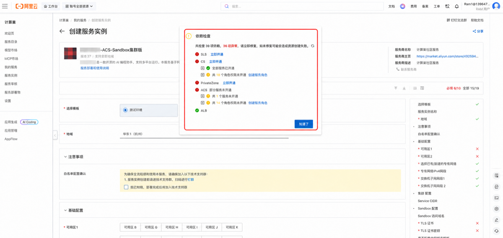
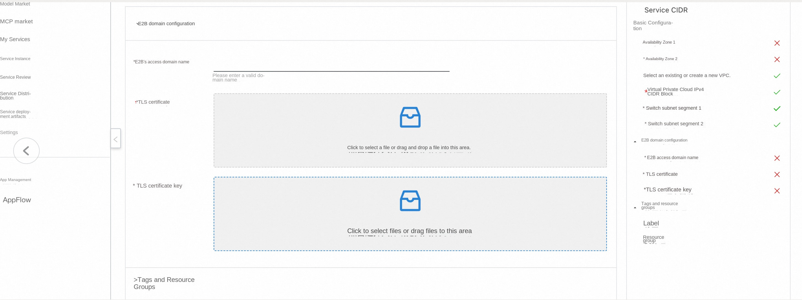

# Deploy Agent Sandbox with Alibaba Cloud ComputeNest

This guide shows you how to deploy an E2B-compatible Agent Sandbox service with Alibaba Cloud ComputeNest. You can create an Alibaba Cloud Container Compute Service (ACS) cluster, create a Container Service for Kubernetes (ACK) cluster, or install Agent Sandbox components in an existing ACK cluster. After deployment, use the E2B SDK to create, run, pause, and reconnect to sandboxes.

## Quick start

Complete these steps to obtain a Sandbox API endpoint and access key for the E2B SDK.

1. Open the [Alibaba Cloud China deployment page](https://computenest.console.aliyun.com/service/instance/create/cn-hangzhou?type=user&ServiceId=service-47d7c54c78604e0bbe79) or the [Alibaba Cloud International deployment page](https://computenest.console.alibabacloud.com/service/instance/create/ap-southeast-1?type=user&ServiceId=service-7c3a2fa4dd3e46519c59), depending on your account.
2. Select **ACS 部署** (ACS), **ACK 部署** (new ACK), or **Existing ACK Deployment**.
3. Configure the network, Sandbox domain, TLS certificate, and API key.
4. Review the cost and create the service instance.
5. Wait until the instance status is **Deployed**, then copy `E2B_DOMAIN` and `E2B_API_KEY` from the instance details. New ACS/ACK deployments also output `ALB_DNS_Name`.
6. Configure DNS, then run the [automated verification](#automated-verification) or [local API verification](#local-api-verification).

## Choose a deployment mode

All three modes expose the same E2B-compatible API, but they differ in cluster ownership and prerequisites.

| Deployment mode | Use when | Main resources created by ComputeNest | Prepare in advance |
| --- | --- | --- | --- |
| `ACS 部署` (ACS) | You want serverless container capacity without managing worker nodes | ACS cluster, network, ALB, and Agent Sandbox components | Domain and TLS certificate |
| `ACK 部署` (new ACK) | You need full Kubernetes worker nodes and cluster configuration | ACK cluster, worker nodes, network, ALB, and Agent Sandbox components | Domain and TLS certificate |
| `Existing ACK Deployment` | You want to reuse an ACK cluster and VPC | Agent Sandbox components and test pod; installs ALB Ingress Controller and `ack-virtual-node` when absent | Working ACK cluster, VSwitches in two zones, domain, and TLS certificate |

Choose **ACS 部署** unless you need an existing cluster or node-level configuration. Choose **ACK 部署** for workloads that depend on worker-node settings. Choose **Existing ACK Deployment** only after you verify the target cluster add-ons and networking.

## Before you begin

Prepare account permissions, a domain, and a certificate before deployment. Existing ACK deployments also require add-on checks on the target cluster.

### Activate cloud services

On the first deployment, ComputeNest prompts you to activate dependent cloud services and create service-linked roles. This operation usually requires cloud-product administrator permissions and only needs to be completed once per account.



Use either of these methods:

- Ask an administrator to open the deployment page and complete the activation prompts.
- Temporarily grant activation permissions to the RAM user that performs the deployment, then remove the elevated permissions.

If you need a custom policy, review the [first-time service activation policy](open_policy.json).

### Grant permissions to a RAM user

A Resource Access Management (RAM) user must have these policies:

- `AliyunComputeNestUserFullAccess` to manage user-side ComputeNest resources.
- `AliyunROSFullAccess` to manage Resource Orchestration Service (ROS) resources.
- The [Agent Sandbox custom policy](policy.json) to manage other resources used by the templates.

An administrator can follow [Grant permissions to a RAM user](https://help.aliyun.com/zh/compute-nest/security-and-compliance/grant-user-permissions-to-a-ram-user). Apply least privilege to production accounts.

### Prepare a domain and TLS certificate

E2B clients access the Sandbox API over HTTPS. Use a dedicated subdomain such as `sandbox.example.com`; don't use an existing business domain or its public parent domain.

The certificate must cover both names:

- `sandbox.example.com`
- `*.sandbox.example.com`

Use a publicly trusted certificate in production. For testing only, use the [OpenKruise certificate generation script](https://github.com/openkruise/agents/blob/master/hack/generate-certificates.sh) to create a self-signed certificate:

```bash
curl -O https://raw.githubusercontent.com/openkruise/agents/master/hack/generate-certificates.sh
chmod +x generate-certificates.sh
./generate-certificates.sh --domain sandbox.example.com --days 365
```

The deployment uses these files:

- `fullchain.pem`: Upload this file under **TLS Certificate**.
- `privkey.pem`: Upload this file under **TLS Private Key**.
- `ca-fullchain.pem`: Configure this file as the client trust chain for local tests with a self-signed certificate.

The private key is sensitive. Don't commit `privkey.pem` or paste it into chat messages or tickets.

### Check an existing ACK cluster

Before selecting **Existing ACK Deployment**, open **Operations > Add-ons** for the target cluster in the ACK console and check these add-ons:

- `alb-ingress-controller`: It can be absent or installed with a working configuration. The template installs it and creates a default `AlbConfig` when absent. It preserves the existing add-on and configuration when present.
- `ack-virtual-node`: It can be absent or at version `v2.17.0` or later. The template installs it when absent. You must manually upgrade an installed version older than `v2.17.0`.

The target VPC must also have one ALB VSwitch in each of two different zones.

## Create the service instance

ComputeNest displays parameters for the selected deployment mode. The following settings apply to both Alibaba Cloud China and Alibaba Cloud International.

### 1. Open the deployment page

Open the page for your account site:

- [Alibaba Cloud China Agent Sandbox deployment](https://computenest.console.aliyun.com/service/instance/create/cn-hangzhou?type=user&ServiceId=service-47d7c54c78604e0bbe79)
- [Alibaba Cloud International Agent Sandbox deployment](https://computenest.console.alibabacloud.com/service/instance/create/ap-southeast-1?type=user&ServiceId=service-7c3a2fa4dd3e46519c59)

Select the target region and deployment mode at the top of the page.

### 2. Configure the cluster and network

For **ACS 部署** or **ACK 部署**, create a VPC or select an existing VPC. When you create a cluster, make sure the VPC CIDR, VSwitch CIDRs, and Kubernetes Service CIDR don't overlap.

For **Existing ACK Deployment**, complete these steps:

1. Select the target `ClusterId`.
2. Confirm that the automatically associated VPC is correct.
3. Select the ALB network type: `Internet` for a public ALB or `Intranet` for a private ALB.
4. Select two different zones and a VSwitch in the same VPC for each zone.

The ALB network type takes effect only when the template needs to install `alb-ingress-controller`. The template doesn't overwrite an existing installation.

### 3. Configure Sandbox settings

Enter these Sandbox settings:

| Setting | Purpose | Recommendation |
| --- | --- | --- |
| **Sandbox Domain** | Base domain used by E2B clients | Use a dedicated subdomain such as `sandbox.example.com` |
| **TLS Certificate** | PEM-encoded server certificate chain | Upload `fullchain.pem` |
| **TLS Private Key** | Private key matching the certificate | Upload `privkey.pem` |
| **Sandbox API Key** | Access key for Sandbox API requests | Keep the generated value or enter a separate strong key |
| **Sandbox Manager CPU** | CPU cores allocated to the manager | Default: `2`; adjust for concurrency |
| **Sandbox Manager Memory** | Memory allocated to the manager | Default: `4Gi`; adjust for concurrency |



### 4. Create and wait for the deployment

Review the price and resource configuration, then select **Confirm Order**. In the ComputeNest console, wait until the service instance status changes to **Deployed**.

Copy these outputs from the instance details:

| Output | Deployment modes | Purpose |
| --- | --- | --- |
| `E2B_DOMAIN` | All | Base domain for the E2B SDK |
| `E2B_API_KEY` | All | Sandbox API access key; the console treats it as a sensitive value |
| `ALB_DNS_Name` | New ACS/ACK | CNAME target for public or private DNS |
| `ClusterId` | All | Cluster identifier for the ACS or ACK console |
| Follow-up steps | Existing ACK | Configure the Ingress HTTPS listener and DNS |

## Configure DNS

After deployment, resolve the API hostname and wildcard hostname to the ALB endpoint. New ACS/ACK deployments provide this endpoint as `ALB_DNS_Name`. For an existing ACK deployment, first follow the service-instance outputs to configure the Ingress HTTPS listener, then obtain the ALB endpoint from the ACK console. Use DNS CNAME records in production. Use a local hosts file only for short tests.

### Production DNS

Create at least these records, replacing `sandbox.example.com` with the domain entered during deployment:

| Hostname | Record type | Value |
| --- | --- | --- |
| `api.sandbox.example.com` | CNAME | `ALB_DNS_Name` from the service instance |
| `*.sandbox.example.com` | CNAME | `ALB_DNS_Name` from the service instance |

For VPC-only access, create the same records in PrivateZone and associate the VPC that contains the target ACS or ACK cluster. PrivateZone authoritative resolution can affect other records under the same suffix, so use a dedicated subdomain.

For an existing ACK deployment, also follow the service-instance outputs to confirm that the Ingress HTTPS listener and certificate configuration are active.

### Local hosts-file test

A hosts file is suitable only for temporary testing and can't express a wildcard record. Resolve the ALB hostname, then add each hostname that you need:

```bash
dig +short ALB_DNS_NAME
sudo sh -c 'printf "%s %s\n" "ALB_PUBLIC_IP" "api.sandbox.example.com" >> /etc/hosts'
```

Replace `ALB_DNS_NAME` and `ALB_PUBLIC_IP` with actual values. Remove the hosts-file entry after testing.

## Verify the deployment

Run the bundled tests inside the cluster or call the Sandbox API from your local computer.

### Automated verification

The template creates `acs-sandbox-test-pod` in the `default` namespace and installs `test_code.py`, `test_browser.py`, and `test_desktop.py`.

1. From the service-instance details, open the ACS or ACK console.
2. Open **Workloads > Pods** for the target cluster and select the `default` namespace.
3. Find `acs-sandbox-test-pod` and open its terminal.
4. Run the core feature test:

   ```bash
   cd /app
   python test_code.py
   ```

5. Run the browser or desktop tests when needed:

   ```bash
   python test_browser.py
   python test_desktop.py
   ```

A successful core test creates a sandbox and executes code. If the test pod isn't `Running`, inspect its events and container logs first.

### Local API verification

Set the service outputs and call the sandbox-creation endpoint. For a self-signed certificate, configure `ca-fullchain.pem` as the trust chain:

```bash
export E2B_DOMAIN='sandbox.example.com'
export E2B_API_KEY='e2b_replace_with_your_key'

curl --fail-with-body \
  --cacert ./ca-fullchain.pem \
  --request POST "https://api.${E2B_DOMAIN}/sandboxes" \
  --header 'Content-Type: application/json' \
  --header "X-API-Key: ${E2B_API_KEY}" \
  --data '{"templateID":"code-interpreter","timeout":300}'
```

A successful response contains a `sandboxID` and a `state` value of `running`. Omit `--cacert` when the service uses a publicly trusted certificate.

### Use the E2B Python SDK

Install the SDK and provide the domain and key through environment variables:

```bash
python3 -m pip install e2b-code-interpreter python-dotenv
export E2B_DOMAIN='sandbox.example.com'
export E2B_API_KEY='e2b_replace_with_your_key'
export SSL_CERT_FILE="$PWD/ca-fullchain.pem"
```

Create `verify_sandbox.py`:

```python
from e2b_code_interpreter import Sandbox


def main() -> None:
    sandbox = Sandbox.create(template="code-interpreter", request_timeout=60)
    result = sandbox.commands.run("whoami")
    print(result.stdout.strip())
    sandbox.kill()


if __name__ == "__main__":
    main()
```

Run the script:

```bash
python verify_sandbox.py
```

To test pause and reconnect behavior, run [`test_sandbox.py`](https://github.com/aliyun-computenest/quickstart-Sandbox-Manager-E2B/blob/main/test_sandbox.py) from this repository. The script is for testing only; don't use it for production jobs.

## Default sandbox types

New ACS and new ACK deployments create several warm pools. Existing ACK deployment currently creates only code-interpreter and desktop warm pools.

| Template ID | Purpose | ACS / new ACK | Existing ACK |
| --- | --- | --- | --- |
| `sandbox` | General code execution | Created | Not created |
| `code-interpreter` | Python code interpreter | Created | Created |
| `browser` | Browser automation | Created | Not created |
| `desktop` | Desktop automation | Created | Created |
| `android` | Android automation | Created | Not created |

If you customize a SandboxSet and need pause and reconnect behavior, don't add a `livenessProbe` or `readinessProbe`. These probes can restart a sandbox while it is paused.

## Troubleshooting

Use this table to diagnose common deployment and first-run failures.

| Symptom | Likely cause | Fix |
| --- | --- | --- |
| Deployment page reports missing permissions or can't activate a service | The RAM user lacks ComputeNest, ROS, or cloud-service activation permissions | Ask an administrator to complete the first activation and grant the policies in [Grant permissions to a RAM user](#grant-permissions-to-a-ram-user) |
| Existing ACK deployment fails while installing add-ons | `ack-virtual-node` is older than `v2.17.0`, or the existing ALB configuration isn't usable | Upgrade the add-on or repair the existing `AlbConfig` in the ACK console, then deploy again |
| `acs-sandbox-test-pod` is in `ImagePullBackOff` | The VPC can't reach the image registry or its outbound network is incomplete | Check VPC, SNAT, and registry connectivity, then inspect pod events |
| API returns `401` or `403` | `E2B_API_KEY` is incorrect | Copy the key again from the service instance and remove whitespace from the environment variable |
| TLS verification fails | The certificate doesn't cover the API and wildcard hostnames, or the client doesn't trust the self-signed CA | Check certificate SANs; set `SSL_CERT_FILE` or `--cacert` for tests, and use a trusted certificate in production |
| API hostname doesn't resolve | API or wildcard CNAME is missing, or PrivateZone isn't associated with the target VPC | Check DNS records, ALB address type, and the PrivateZone effective scope |
| A paused sandbox is recreated | A customized SandboxSet has liveness or readiness probes | Remove `livenessProbe` and `readinessProbe`, then apply the SandboxSet again |

If the problem continues, save the service-instance ID, failed resource name, and error message. Don't paste API keys, TLS private keys, or other credentials into a support ticket.

## Next steps

After verification, prepare the service for production use:

- Replace test certificates with certificates issued by a publicly trusted CA.
- Store `E2B_API_KEY` in a secret manager instead of source code or container images.
- Adjust Sandbox Manager and warm-pool resources for expected concurrency.
- Configure monitoring and alerts for ALB, Sandbox Manager, and cluster resources.
- Limit network exposure and use a public ALB only when required.

中文说明请参见[中文部署指南](index.md)。
