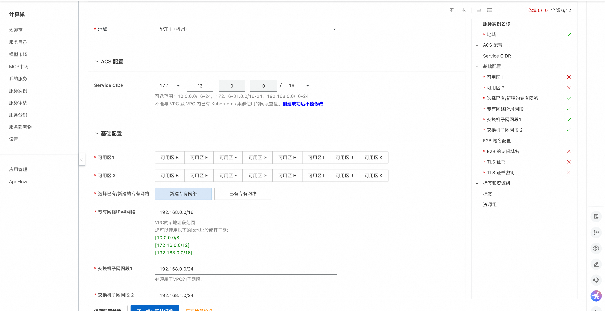
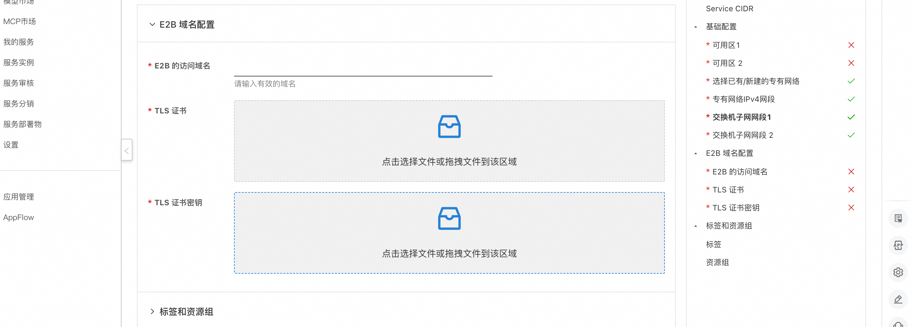
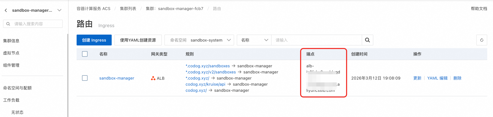

# 在ACS集群中使用 E2B 管理安全沙箱

## 概述

E2B 是一个流行的开源安全沙箱框架，提供了一套简单易用的 Python 与 JavaScript SDK 供用户对安全沙箱进行创建、查询、执行代码、请求端口等操作。
acs-sandbox-manager组件是一个兼容 E2B 协议的后端应用，使用户在任何 K8s 集群中一键搭建一个性能媲美原生 E2B 的沙箱基础设施。

本服务提供了在ACS 集群中快速搭建安全沙箱的解决方案，支持使用 E2B 协议进行交互。

## 前提准备

标准的 E2B 协议需要一个域名（E2B_DOMAIN）来指定后端服务。为此，您需要准备一个自己的域名。
E2B 客户端必须通过 HTTPS 协议请求后端，并且每次请求的子域名都可能不同，因此还需要为服务申请一个通配符证书。

### 准备域名

- 如果您还没有域名，可以参考文档 [域名注册快速入门](https://help.aliyun.com/zh/dws/getting-started/quickly-register-a-new-domain-name) 注册一个自己的域名。
- 如果您的服务部署在中国内地，还需要为域名进行备案，参考文档：[域名备案](https://help.aliyun.com/zh/dws/icp-filing)。

#### 获取泛域名通配符证书
在生产场景下，推荐您参考文档 [购买正式证书](https://help.aliyun.com/zh/ssl-certificate/user-guide/purchase-an-ssl-certificate) 申请一个正式的通配符域名证书。

在测试场景下，您可以参考以下步骤通过 Let's Encrypt 申请一个免费的测试证书。
1. 通过系统的包管理器（brew、snap 等）安装 certbot，更多安装信息请查看 [官方文档](https://certbot.eff.org/)。
2. 参考以下命令，修改 -d 与 --email 的参数为泛域名*.your.domain.cn 申请通配符证书。请根据命令的提示进行验证操作。

```bash
$ sudo certbot certonly \
  --manual \
  --preferred-challenges=dns \
  --email your-email@example.com \
  --server https://acme-v02.api.letsencrypt.org/directory \
  --agree-tos \
  -d "*.your.domain.cn"
```
3. 导出证书
```bash
$ sudo cp /etc/letsencrypt/live/your.domain/fullchain.pem ./fullchain.pem
$ sudo cp /etc/letsencrypt/live/your.domain/privkey.pem ./privkey.pem
```

## 部署流程

1. 打开计算巢服务[部署链接](https://computenest.console.aliyun.com/service/instance/create/cn-hangzhou?type=user&ServiceId=service-47d7c54c78604e0bbe79)
2. 填写相关部署参数、选择部署地域、ACS集群的Service CIDR, 专有网络配置 
3. 填写E2B 域名配置，E2B的访问域名配置为上述前提准备阶段的域名， 
   1. TLS 证书选择fullchain.pem文件
   2. TLS 证书私钥选择privkey.pem文件
         
4.配置完成后，点击确认订单

## 使用沙箱
 
 部署完成后，会得到一个对应的ACS集群，ACS集群中在sandbox-system命名空间下有sandbox-manager的Deployment，用于管理沙箱
 创建出来的沙箱，会在default 命名空间下

### 配置域名的解析
1. 集群中使用MSE 网关作为Ingress，在[MSE控制台](https://mse.console.aliyun.com/#/microgw?region=cn-hangzhou)找到ACS集群创建出来的网关，可以通过标签来查找

2. 获取到MSE网关的公网域名 
3. 请将主机记录 *.your.domain.cn 以 CNAME 记录类型解析到对应域名。

### 使用沙箱demo
acs-sandbox-manager 组件暂时只支持以下三个内置的模板：
1. code-interpreter：E2B 官方的 code-interpreter 镜像，可以执行 Python 代码。
2. desktop：E2B 官方的 desktop 镜像，用于通过 e2b_desktop 库远程操作图形桌面。
3. browser：Google 官方的 headless-shell 镜像，为 browser_use 等应用提供了 Chrome 浏览器环境。

#### 设置环境变量

```bash
export E2B_DOMAIN=your.domain.cn

```

### 执行代码
以下脚本演示了创建沙箱、执行代码、读写文件、销毁沙箱等基本功能。
```python
import os
# Import the E2B SDK
from e2b_code_interpreter import Sandbox

# Create a sandbox using the E2B Python SDK
sbx = Sandbox.create(template="code-interpreter", timeout=300)
print(f"sandbox id: {sbx.sandbox_id}")

def execute_python_code(s: Sandbox, code: str):
    # Execute Python code inside the sandbox
    execution = s.run_code(code)
    if execution.error:
        print(f"Error executing code: {execution.error}")
    else:
        print(execution.logs.stdout)

execute_python_code(sbx, "print('hello world')")
execute_python_code(sbx, "a = 1")
execute_python_code(sbx, "b = 2")
execute_python_code(sbx, "print(a + b)")

execute_python_code(sbx, """
def bubble_sort(arr):
    n = len(arr)
    # 创建数组副本，避免修改原数组
    sorted_arr = arr.copy()
    
    # 外层循环控制排序轮数
    for i in range(n):
        # 标记本轮是否发生交换
        swapped = False
        # 内层循环进行相邻元素比较
        for j in range(0, n - i - 1):
            # 如果前一个元素大于后一个元素，则交换
            if sorted_arr[j] > sorted_arr[j + 1]:
                sorted_arr[j], sorted_arr[j + 1] = sorted_arr[j + 1], sorted_arr[j]
                swapped = True
        # 如果本轮没有发生交换，说明数组已经有序，可以提前结束
        if not swapped:
            break
    
    return sorted_arr
print(bubble_sort([1,6,4,2,3,7,5]))
""")

# List files in the sandbox
try:
    # Read local file relative to the current working directory
    with open(os.path.abspath(__file__), "rb") as file:
        sbx.files.write("/home/user/my-file", file)
    file_content = sbx.files.read("/home/user/my-file")
    print(file_content)
except Exception as e:
    # Print the full stack trace for debugging
    import traceback

    traceback.print_exc()
    print(f"Error listing files: {e}")
    raise e
finally:
    sbx.kill()
    print(f"sandbox {sbx.sandbox_id} killed")

```
预期输出
```html
sandbox id: code-interpreter-5df5b8dd48-dpxjb
['hello world\n']
[]
[]
['3\n']
['[1, 2, 3, 4, 5, 6, 7]\n']
```

### 控制桌面
以下脚本演示了申请沙箱、启动程序、键盘输入、销毁沙箱等基本功能。
模板仅内置了一个未优化的桌面环境，启动时会有一些弹窗，需要通过串流手动关闭后再执行 Chrome 访问百度的自动化操作。
```python
import time

from e2b_desktop import Sandbox

# Create a new desktop sandbox
desktop = Sandbox.create(api_key="GG", template="desktop")
print(f"sandboxId: {desktop.sandbox_id}")
# Launch an application
desktop.launch('google-chrome')  # or vscode, firefox, etc.
print("waiting 5 seconds for desktop launching")
time.sleep(5)
# Stream the application's window
# Note: There can be only one stream at a time
# You need to stop the current stream before streaming another application
desktop.stream.start(
    # window_id=desktop.get_current_window_id(), # if not provided the whole desktop will be streamed
    require_auth=True
)

# Get the stream auth key
auth_key = desktop.stream.get_auth_key()

# Print the stream URL
print('Stream URL:', desktop.stream.get_url(auth_key=auth_key))

input("select the address bar and press ENTER to visit baidu.com")
desktop.write("www.baidu.com")
time.sleep(0.5)
desktop.press("enter")

input("press ENTER to exit")


# Kill the sandbox after the tasks are finished
desktop.kill()
```

等待桌面串流启动
```
sandboxId: desktop-7c84c88b8-tpjmg
waiting 5 seconds for desktop launching
Stream URL: https://6080-desktop-7c84c88b8-tpjmg.your.domain/vnc.html?autoconnect=true&resize=scale&password=*****
select the address bar and press ENTER to visit baidu.com
```
访问 Stream URL，可以看到一个打开了 Chrome 的 Linux 桌面
回到终端敲回车，可以看到桌面自动打开了百度。

### 控制浏览器
内置模板browser是以 E2B Sandbox 形式透出，兼容开源项目browser_use的浏览器环境。相比desktop模板，将整个桌面环境替换为了一个 headless chrome 浏览器，提高了资源利用效率。
这个例子使用 browser_use 框架编写了一个完整的 Agent，该 Agent 通过 OpenAI 协议调用了阿里云百联平台上的 qwen-plus 大模型。因此，如果要体验该实例您需要在百炼平台上创建一个 API Key 并配置以下环境变量：

```bash
export LLM_API_KEY=sk-*********
export LLM_BASE_URL=https://dashscope.aliyuncs.com/compatible-mode/v1
```
以下脚本演示了如何从沙箱中获取浏览器 session 并让 Agent 使用以执行任务
```python
import asyncio
import os
import time

from browser_use import Agent, BrowserSession
from browser_use.llm import ChatOpenAI
from e2b_code_interpreter import Sandbox

async def screenshot(agent: Agent):
    try:
        print("开始截图...")
        page = await agent.browser_session.get_current_page()
        screenshot_bytes = await page.screenshot(full_page=True, type='png')
        screenshots_dir = os.path.join(".", "screenshots")
        os.makedirs(screenshots_dir, exist_ok=True)
        screenshot_path = os.path.join(screenshots_dir, f"{time.time()}.png")
        with open(screenshot_path, "wb") as f:
            f.write(screenshot_bytes)
        print(f"截图已保存至 {screenshot_path}")
    except Exception as e:
        print(f"截图失败: {e}")

async def main():
    # 创建 E2B 沙箱实例
    sandbox = Sandbox.create(api_key="GG", template="browser")
    try:
        # 创建 Browser-use 会话
        browser_session = BrowserSession(cdp_url=f"https://api.{sandbox.sandbox_domain}/browser/{sandbox.sandbox_id}") # 使用 cdp 协议连接远程沙箱中的浏览器
        await browser_session.start()
        print("Browser-use 会话创建成功")

        # 创建 AI Agent
        agent = Agent(
            task="""
            从阿里云 ACS 产品计费官方文档（https://help.aliyun.com/zh/cs/product-overview/billing/）进入计费说明，总结不同地域、计算类型、算力质量的费用差别
            """,
            llm=ChatOpenAI(
                api_key=os.getenv("LLM_API_KEY"),
                base_url=os.getenv("LLM_BASE_URL"),
                model="qwen-plus",
                temperature=1,
            ),
            browser_session=browser_session,
        )

        # 运行 Agent 任务
        print("开始执行 Agent 任务...")
        await agent.run(
            on_step_end=screenshot, # 在每个步骤结束时调用 screenshot 截图
        )

        # 关闭浏览器会话
        await browser_session.close()
        print("任务执行完成")

    finally:
        # 清理沙箱资源
        sandbox.kill()
        print("沙箱资源已清理")

if __name__ == "__main__":
    asyncio.run(main())
```

运行脚本后，在终端上可以看到大模型思考、执行的过程。每一步执行完毕后，都会截图保存在工作目录中的 screenshot 子目录下。
