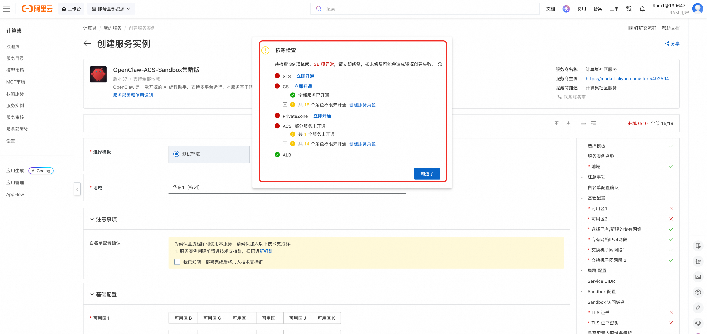
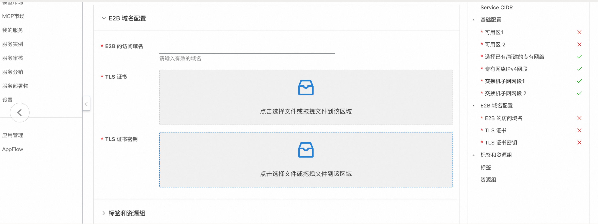
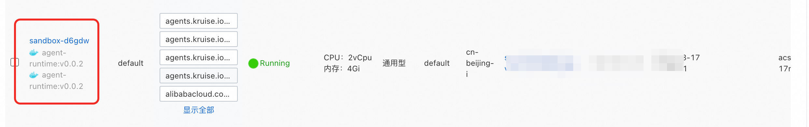
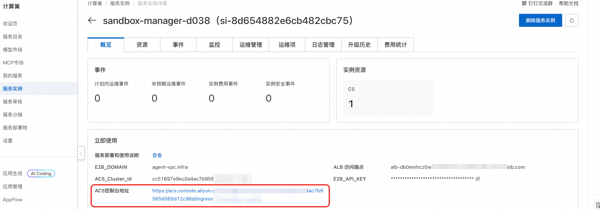
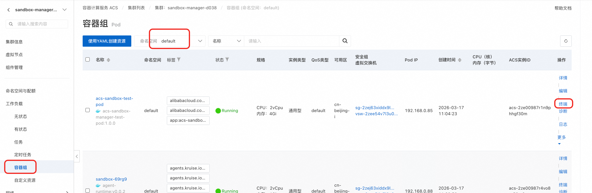

# 在ACS集群中使用 E2B 管理安全沙箱

## 概述

E2B 是一个流行的开源安全沙箱框架，提供了一套简单易用的 Python 与 JavaScript SDK 供用户对安全沙箱进行创建、查询、执行代码、请求端口等操作。 ack-sandbox-manager组件是一个兼容 E2B 协议的后端应用，使用户在任何 K8s 集群中一键搭建一个性能媲美原生 E2B 的沙箱基础设施。

本服务提供了在ACS 集群中快速搭建安全沙箱的解决方案，支持使用 E2B 协议进行交互。

## 前置准备

标准的 E2B 协议需要一个域名（E2B\_DOMAIN）来指定后端服务。为此，您需要准备一个自己的域名。 E2B 客户端必须通过 HTTPS 协议请求后端，因此还需要为服务申请一个通配符证书。

以下介绍了测试场景下的域名和证书准备步骤，生成的fullchain.pem和privkey.pem文件在后续部署环节会用到。

### 准备域名

*   测试场景中，为了方便验证，可以使用测试域名，比如示例：agent-vpc.infra。
    

### 获取自签名证书

通过脚本[generate-certificate.sh](https://github.com/openkruise/agents/blob/master/hack/generate-certificates.sh) 创建自签名证书, 您可以通过以下命令查看脚本的使用方法。

```plaintext
$ bash generate-certificates.sh --help

Usage: generate-certificates.sh [OPTIONS]

Options:
  -d, --domain DOMAIN     Specify certificate domain (default: your.domain.com)
  -o, --output DIR        Specify output directory (default: .)
  -D, --days DAYS         Specify certificate validity days (default: 365)
  -h, --help              Show this help message

Examples:
  generate-certificates.sh -d myapp.your.domain.com
  generate-certificates.sh --domain api.your.domain.com --days 730
```

生成证书的命令示例：

```plaintext
./generate-certificates.sh --domain agent-vpc.infra --days 730
```

完成证书生成后，您会得到以下文件：

*   fullchain.pem：服务器证书公钥
    
*   privkey.pem：服务器证书私钥
    
*   ca-fullchain.pem：CA 证书公钥
    
*   ca-privkey.pem：CA 证书私钥 该脚本会同时生成单域名（your.domain）与泛域名（\*.your.domain）证书，兼容原生 E2B 协议与 OpenKruise 定制 E2B 协议。
    
### 开通服务
如果您之前没有使用过相关云服务，在部署时会提示您先开通服务和创建相应服务角色，如下图所示，

此步骤需要的权限相对风险较高(需要云产品的管理员权限)，推荐您选用以下两种方式进行开通：
注意：开通为一次性操作，仅第一次操作时需要开通。
1. 联系有管理员权限的用户打开计算巢服务部署链接，让管理员用户按照提示进行开通。
2. 联系有管理员权限的用户对RAM用户暂时授予管理员权限，RAM用户得到授权后进行开通，需要的权限策略如下。
开通服务权限策略：[open_policy.json](https://github.com/aliyun-computenest/openclaw-acs-sandbox/blob/main/docs/open_policy.json)


### 给RAM 用户授权

如果您使用的是RAM用户，需要授权RAM用户相关权限，才能够完成部署流程，参考[授权文档](https://help.aliyun.com/zh/compute-nest/security-and-compliance/grant-user-permissions-to-a-ram-user)
 
部署此服务需要的权限策略包括两个系统权限策略和一个自定义权限策略, 请联系有管理员权限的用户对RAM用户授予以下权限：
 **系统权限策略：**
- AliyunComputeNestUserFullAccess：管理计算巢服务（ComputeNest）的用户侧权限，
- AliyunROSFullAccess：管理资源编排服务（ROS）的权限。
 **自定义权限策略：**
- 权限策略：[policy.json](https://github.com/aliyun-computenest/quickstart-Sandbox-Manager-E2B/blob/main/docs/policy.json)


## 部署流程

1.  打开计算巢服务[部署链接](https://computenest.console.aliyun.com/service/instance/create/cn-hangzhou?type=user&ServiceId=service-47d7c54c78604e0bbe79)
    
2.  填写相关部署参数、选择部署地域、ACS集群的Service CIDR, 专有网络配置
    
    
    
3.  填写E2B 域名配置，E2B的访问域名配置为上述前提准备阶段的域名，
    
    1.  TLS 证书选择fullchain.pem文件
        
    2.  TLS 证书私钥选择privkey.pem文件 
        
    
    
4.  会生成访问E2B API的 E2B\_API\_KEY
    
5.  sandbox-manager 组件默认的CPU和内存配置默认为2C, 4Gi, 可以按需调整
    
6.  配置完成后，点击确认订单
    
7.  部署成功后，在服务实例的详情页也可以查看E2B\_API\_KEY、E2B\_DOMAIN等信息 
    


## OpenClaw沙箱定义说明

计算巢默认 会通过以下 yaml 创建一个单副本的 SandboxSet预热池（相当于e2b的模版），后续如果自己构建了镜像，可以直接替换集群中的containers的镜像。 若为了提升拉取速度，也可替换为内网镜像：registry-${RegionId}-vpc.ack.aliyuncs.com/acs/agent-runtime:v0.0.2

```yaml
aapiVersion: agents.kruise.io/v1alpha1
kind: SandboxSet
metadata:
  name: sandbox
  namespace: default
  annotations:
    e2b.agents.kruise.io/should-init-envd: "true"
  labels:
    app: sandbox
spec:
  persistentContents: 
  - filesystem
  replicas: 1
  template:
    metadata:
      labels:        
        alibabacloud.com/acs: "true" # 使用ACS算力
        app: sandbox
      annotations:
        ops.alibabacloud.com/pause-enabled: "true" # 支持pause
    spec:
      restartPolicy: Always
      automountServiceAccountToken: false #Pod 不挂载 service account
      enableServiceLinks: false #Pod 不注入 service 环境变量
      initContainers:
        - name: init
          image: registry-cn-hangzhou.ack.aliyuncs.com/acs/agent-runtime:v0.0.2
          imagePullPolicy: IfNotPresent
          command: [ "sh", "/workspace/entrypoint_inner.sh" ]
          volumeMounts:
            - name: envd-volume
              mountPath: /mnt/envd
          env:
            - name: ENVD_DIR
              value: /mnt/envd
            - name: __IGNORE_RESOURCE__
              value: "true"
          restartPolicy: Always
      containers:
        - name: sandbox
          image: registry-cn-hangzhou.ack.aliyuncs.com/acs/agent-runtime:v0.0.2        
          imagePullPolicy: IfNotPresent
          securityContext:
            readOnlyRootFilesystem: false
            runAsGroup: 0
            runAsUser: 0
          resources:
            requests:
              cpu: 2
              memory: 4Gi
            limits:
              cpu: 2
              memory: 4Gi
          env:
            - name: ENVD_DIR
              value: /mnt/envd
          volumeMounts:
            - name: envd-volume
              mountPath: /mnt/envd            
          startupProbe:
            tcpSocket:
              port: 49983
            initialDelaySeconds: 5
            periodSeconds: 5
            failureThreshold: 30
          lifecycle:
            postStart:
              exec:
                command: [ "/bin/bash", "-c", "/mnt/envd/envd-run.sh" ]        
      terminationGracePeriodSeconds: 30  # 可以按照实际退出的速度来调整
      volumes:
        - emptyDir: { }
          name: envd-volume
```

**重要字段说明**

*   SandboxSet.spec.persistentContents: filesystem #在pause，connect的过程中只保留文件系统（不保留ip、mem）
    
*   template.spec.restartPolicy: Always
    
*   template.spec.automountServiceAccountToken: false #Pod 不挂载 service account
    
*   template.spec.enableServiceLinks: false #Pod 不注入 service 环境变量
    
*   template.metadata.labels.alibabacloud.com/acs: "true"
    
*   template.metadata.annotations.ops.alibabacloud.com/pause-enabled: "true" # 支持pause, connect 动作
    
*   template.spec.initContainer #下载并copy envd 的环境 ， 保留即可
    
*   template.spec.initContainers.restartPolicy: Always
    
*   template.spec.containers.securityContext.runAsNonRoot: true #Pod 使用普通用户启动
    
*   template.spec.containers.securityContext.privileged: false # 禁用特权配置
    
*   template.spec.containers.securityContext.allowPrivilegeEscalation: false
    
*   template.spec.containers.securityContext.seccompProfile.type.RuntimeDefault
    
*   template.spec.containers.securityContext.capabilities.drop: \[ALL\]
    
*   template.spec.containers.securityContext.readOnlyRootFilesystem: false
    

如果预期使用Pause，一定不要设置liveness/rediness的探针，避免在暂停期间的健康检查问题 必要的修改

*   registry-cn-hangzhou.ack.aliyuncs.com/acs/agent-runtime # 修改为所在地域的镜像，并且是内网镜像【目前，未来会自动注入】
     

机制的简要说明 通过在pod启动envd，来支持e2b sdk的服务端接口

通过kubectl 创建上述资源，SandboxSet创建完成后，可以看到1个沙箱已经处于可用状态： 


# 服务部署验证

部署完成后，会得到一个对应的ACS集群，ACS集群中在sandbox-system命名空间下有sandbox-manager的Deployment，用于管理沙箱。 通过以下流程验证E2B服务已经正常运行，并介绍沙箱使用Demo.

该部分分为自动化测试和手动测试可选其中一种测试步骤验证核心功能，两种测试方式验证的功能一致，均包含沙箱创建，休眠和重新连接部分。

##  自动化测试
1. 点击计算巢服务实例，找到实例内包含的acs的集群。
2. 点击集群容器组界面，找到acs-test-pod，点击终端登录
3. 执行 python test_sandbox.py 
4. 等待脚本验证所有功能通过

## 手动测试 (可选)
### 配置域名的解析
#### 本地配置Host: 用于快速验证

1.  获取ALB的访问端点：ack-sandbox-manager 集群中使用Alb作为Ingress，在服务实例详情页，可以找到ACS控制台的链接，点击链接查看sandbox-manager的网关，可以获取ALB的访问端点，如下图所示 
    
    
    
2.  获取Alb端点对应的公网地址：本地通过ping ALB的访问端点得到公网Ip `ping alb-xxxxxx`
    
3.  将ALB的公网地址和域名配置到本地host：`echo "ALB_PUBLIC_IP api.E2B_DOMAIN" >> /etc/hosts` 示例为： `xx.xxx.xx.xxx api.agent-vpc.infra`
    
4.  配置完Host后，无需配置DNS解析，在本地就可以管理E2B沙箱，具体使用方式，参考“使用沙箱demo”章节。
    

#### 配置DNS解析：用于生产环境

1.  获取ALB的访问端点： ack-sandbox-manager 集群中使用Alb作为Ingress，在服务实例详情页，可以到ACS控制台的链接，点击链接查看sandbox-manager的网关，可以获取ALB的访问端点，如下图所示 
    
2.  配置DNS解析： 请将Alb的访问端点 以 CNAME 记录类型解析到对应域名， 
    
3.  如需通过内网访问，可以通过PrivateZone 为E2B 添加内网域名。(如果部署时选择了新建VPC, 已经为您自动配置了PrivateZone，后续只需要添加解析记录)【可选】
    

替换xxxx为您前面指定的域名，返回值2xx表示e2b服务已运行,如果是自行签发的证书，需要指定ca-fullchain.pem；或通过配置环境变量使用您本地的证书 【该动作为创建sandbox的动作】e2b使用的可以请自行替换 “admin-987654321"-> 实际的key

```yaml
curl --cacert fullchain.pem -X POST --location "https://api.agent-vpc.infra/sandboxes" \
    -H "Content-Type: application/json" \
    -H "X-API-Key: admin-987654321" \
    -d '{
          "templateID": "sandbox",
          "timeout": 300
        }'
```

当返回结果的json中，存在 "sandboxID" 且 "state":"running"，可以认为e2b服务已运行

### 通过e2b sdk创建一个沙箱

```python
from e2b_code_interpreter import Sandbox

sbx = Sandbox.create(                
    template="sandbox",    
    request_timeout=60,
    metadata={
      "e2b.agents.kruise.io/never-timeout": "true"   #永不过期，不自动kill
    }
)
r = sbx.commands.run("whoami")
print(f"Running in sandbox as \"{r.stdout.strip()}\"")
```

### 休眠唤醒测试代码

```yaml
写入如下文件到 test_sandbox.py

import time
from dotenv import load_dotenv
from e2b_code_interpreter import Sandbox


def main():
    print("Hello from acs-sandbox-test!")
    load_dotenv(override=True)

    # 步骤1: 创建 sandbox
    print("\n[步骤1] 创建 sandbox...")
    start_time = time.monotonic()
    sandbox = Sandbox.create('sandbox', timeout=1800)
    print(f"创建 sandbox 耗时: {time.monotonic() - start_time:.2f} 秒")
    print(f"Sandbox ID: {sandbox.sandbox_id}")
    print(f"envd host: {sandbox.get_host(49983)}")

    # 步骤2: 暂停 sandbox
    print("\n[步骤2] 执行 sandbox beta_pause...")
    start_time = time.monotonic()
    pause_success = sandbox.beta_pause()
    print(f"pause 耗时: {time.monotonic() - start_time:.2f} 秒")
    print(f"pause success: {pause_success}")

    print("等待 60 秒让 sandbox 完全暂停...")
    time.sleep(60)

    # 步骤3: resume 并验证文件持久化
    print("\n[步骤3] 重新连接 sandbox（resume）...")
    start_time = time.monotonic()
    same_sandbox = sandbox.connect(timeout=180)
    print(f"connect 耗时: {time.monotonic() - start_time:.2f} 秒")
    print(f"重新连接成功，Sandbox ID: {same_sandbox.sandbox_id}")


    print("\n所有步骤执行完毕!")


if __name__ == "__main__":
    main()
```
