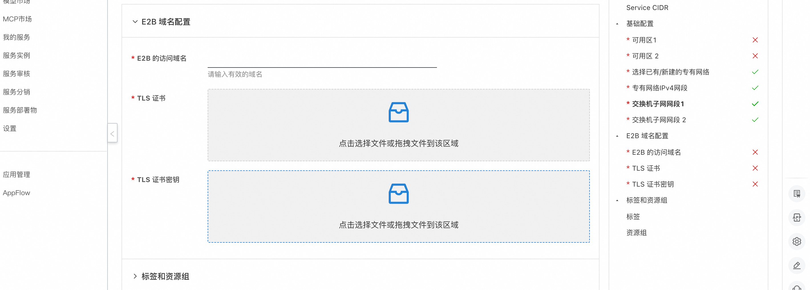
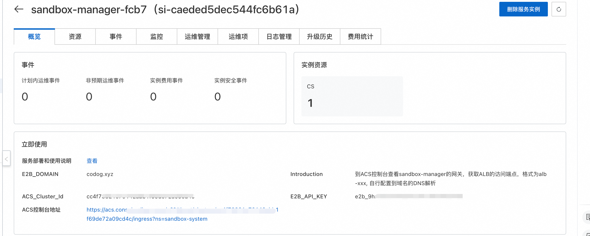
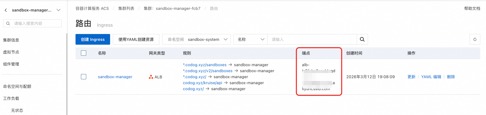
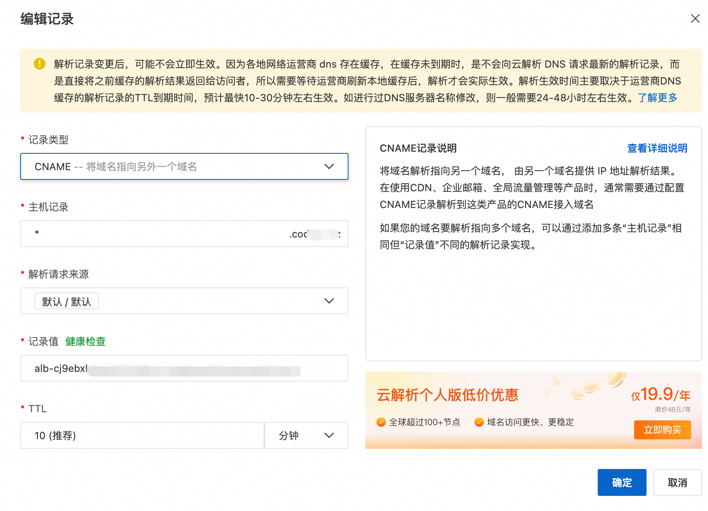

# 在ACS集群中使用 E2B 管理安全沙箱

## 概述

E2B 是一个流行的开源安全沙箱框架，提供了一套简单易用的 Python 与 JavaScript SDK 供用户对安全沙箱进行创建、查询、执行代码、请求端口等操作。
ack-sandbox-manager组件是一个兼容 E2B 协议的后端应用，使用户在任何 K8s 集群中一键搭建一个性能媲美原生 E2B 的沙箱基础设施。

本服务提供了在ACS 集群中快速搭建安全沙箱的解决方案，支持使用 E2B 协议进行交互。

## 前提准备

标准的 E2B 协议需要一个域名（E2B_DOMAIN）来指定后端服务。为此，您需要准备一个自己的域名。
E2B 客户端必须通过 HTTPS 协议请求后端，因此还需要为服务申请一个通配符证书。

以下介绍了测试场景下的域名和证书准备步骤，生成的fullchain.pem和privkey.pem文件在后续部署环节会用到。

#### 准备域名
- 测试场景中，为了方便验证，可以使用测试域名，比如示例：agent-vpc.infra,

#### 获取自签名证书
通过脚本[generate-certificate.sh](https://github.com/openkruise/agents/blob/master/hack/generate-certificates.sh) 创建自签名证书。 您可以通过以下命令查看脚本的使用方法。
```bash
$ bash generate-certificates.sh --help

Usage: generate-certificates.sh [OPTIONS]

Options:
  -d, --domain DOMAIN     Specify certificate domain (default: your.domain.com)
  -o, --output DIR        Specify output directory (default: .)
  -D, --days DAYS         Specify certificate validity days (default: 365)
  -h, --help              Show this help message

Examples:
  generate-certificates.sh -d myapp.your.domain.com
  generate-certificates.sh --domain api.your.domain.com --days 730
```
生成证书的命令示例：
```bash
./generate-certificates.sh --domain agent-vpc.infra --days 730
```
完成证书生成后，您会得到以下文件：

- fullchain.pem：服务器证书公钥
- privkey.pem：服务器证书私钥
- ca-fullchain.pem：CA 证书公钥
- ca-privkey.pem：CA 证书私钥
该脚本会同时生成单域名（your.domain）与泛域名（*.your.domain）证书，兼容原生 E2B 协议与 OpenKruise 定制 E2B 协议。

## 部署流程

1. 打开计算巢服务[部署链接](https://computenest.console.aliyun.com/service/instance/create/cn-hangzhou?type=user&ServiceId=service-47d7c54c78604e0bbe79)
2. 填写相关部署参数、选择部署地域、ACS集群的Service CIDR, 专有网络配置 
3. 填写E2B 域名配置，E2B的访问域名配置为上述前提准备阶段的域名， 
   1. TLS 证书选择fullchain.pem文件
   2. TLS 证书私钥选择privkey.pem文件
         
4. 会生成访问E2B API的 E2B_API_KEY
5. sandbox-manager 组件默认的CPU和内存配置默认为2C, 4Gi, 可以按需调整
6. 配置完成后，点击确认订单
7. 部署成功后，在服务实例的详情页也可以查看E2B_API_KEY、E2B_DOMAIN等信息
         

## 使用沙箱
 
 部署完成后，会得到一个对应的ACS集群，ACS集群中在sandbox-system命名空间下有sandbox-manager的Deployment，用于管理沙箱。
 通过以下流程验证E2B服务已经正常运行，并介绍沙箱使用Demo.

### 配置域名的解析

#### 本地配置Host: 用于快速验证
1. 获取ALB的访问端点：ack-sandbox-manager 集群中使用Alb作为Ingress，在服务实例详情页，可以找到找到ACS控制台的链接，点击链接查看sandbox-manager的网关，可以获取ALB的访问端点，如下图所示

2. 获取Alb端点对应的公网地址：本地通过ping ALB的访问端点得到公网Ip 
```ping alb-xxxxxx```
3. 将ALB的公网地址和域名配置到本地host：```echo "ALB_PUBLIC_IP api.E2B_DOMAIN" >> /etc/hosts```
示例为： 
```xx.xxx.xx.xxx api.agent-vpc.infra```
4. 配置完Host后，无需配置DNS解析，在本地就可以管理E2B沙箱，具体使用方式，参考“使用沙箱demo”章节。

#### 配置DNS解析：用于生产环境
1. 获取ALB的访问端点：
ack-sandbox-manager 集群中使用Alb作为Ingress，在服务实例详情页，可以找到找到ACS控制台的链接，点击链接查看sandbox-manager的网关，可以获取ALB的访问端点，如下图所示

2. 配置DNS解析： 
请将Alb的访问端点 以 CNAME 记录类型解析到对应域名，

3. 如需通过内网访问，可以通过PrivateZone 为E2B 添加内网域名。(如果部署时选择了新建VPC, 已经为您自动配置了PrivateZone，后续只需要添加解析记录)【可选】

### 使用沙箱demo

#### 创建沙箱
计算巢默认 会通过以下 yaml 创建一个单副本的 OpenClaw SandboxSet预热池（相当于e2b的模版），后续如果自己构建了镜像，可以直接替换集群中的openclaw镜像。
若为了提升拉取速度，也可替换为内网镜像：registry-${RegionId}-vpc.ack.aliyuncs.com/ack-demo/openclaw:2026.3.2
```yaml
apiVersion: agents.kruise.io/v1alpha1
kind: SandboxSet
metadata:
  name: openclaw
  namespace: default
  annotations:
    e2b.agents.kruise.io/should-init-envd: "true"
  labels:
    app: openclaw
spec:
  persistentContents: 
  - filesystem
  replicas: 1
  template:
    metadata:
      labels:        
        alibabacloud.com/acs: "true" # 使用ACS算力
        app: openclaw
      annotations:
        ops.alibabacloud.com/pause-enabled: "true" # 支持pause
    spec:
      restartPolicy: Always
      automountServiceAccountToken: false #Pod 不挂载 service account
      enableServiceLinks: false #Pod 不注入 service 环境变量
      initContainers:
        - name: init
          image: registry-cn-hangzhou.ack.aliyuncs.com/acs/agent-runtime:v0.0.2
          imagePullPolicy: IfNotPresent
          command: [ "sh", "/workspace/entrypoint_inner.sh" ]
          volumeMounts:
            - name: envd-volume
              mountPath: /mnt/envd
          env:
            - name: ENVD_DIR
              value: /mnt/envd
            - name: __IGNORE_RESOURCE__
              value: "true"
          restartPolicy: Always
      containers:
        - name: openclaw
          image: registry-cn-hangzhou.ack.aliyuncs.com/ack-demo/openclaw:2026.3.2        
          imagePullPolicy: IfNotPresent
          securityContext:
            runAsNonRoot: true #Pod 使用普通用户启动
            privileged: false # 禁用特权配置
            allowPrivilegeEscalation: false
            seccompProfile:
              type: RuntimeDefault
            capabilities:
              drop:
                - ALL
            readOnlyRootFilesystem: false # 使用只读文件系统（按需） - openclaw 场景不需要，得能写
          resources:
            requests:
              cpu: 4
              memory: 8Gi
            limits:
              cpu: 4
              memory: 8Gi
          env:
            - name: ENVD_DIR
              value: /mnt/envd
            - name: DASHSCOPE_API_KEY 
              value: sk-xxxxxxxxxxxxxxxxx # 替换为您真实的API_KEY
            - name: GATEWAY_TOKEN 
              value: clawdbot-mode-123456 # 替换为您希望访问OpenClaw的token
          volumeMounts:
            - name: envd-volume
              mountPath: /mnt/envd            
          startupProbe:
            tcpSocket:
              port: 18789
            initialDelaySeconds: 5
            periodSeconds: 5
            failureThreshold: 30
          lifecycle:
            postStart:
              exec:
                command: [ "/bin/bash", "-c", "/mnt/envd/envd-run.sh" ]        
      terminationGracePeriodSeconds: 30  # 可以按照实际退出的速度来调整
      volumes:
        - emptyDir: { }
          name: envd-volume
```

重要字段说明
SandboxSet.spec.persistentContents:  filesystem #在pause，connect的过程中只保留文件系统（不保留ip、mem）
template.spec.restartPolicy: Always
template.spec.automountServiceAccountToken: false #Pod 不挂载 service account
template.spec.enableServiceLinks: false #Pod 不注入 service 环境变量

template.metadata.labels.alibabacloud.com/acs: "true"
template.metadata.annotations.ops.alibabacloud.com/pause-enabled: "true" # 支持pause, connect 动作

template.spec.initContainer #下载并copy envd 的环境 ， 保留即可
template.spec.initContainers.restartPolicy: Always

template.spec.containers.securityContext.runAsNonRoot: true  #Pod 使用普通用户启动
template.spec.containers.securityContext.privileged: false # 禁用特权配置
template.spec.containers.securityContext.allowPrivilegeEscalation: false
template.spec.containers.securityContext.seccompProfile.type.RuntimeDefault 
template.spec.containers.securityContext.capabilities.drop: [ALL]
template.spec.containers.securityContext.readOnlyRootFilesystem: false

如果预期使用Pause，一定不要设置liveness/rediness的探针，避免在暂停期间的健康检查问题
必要的修改
registry-cn-hangzhou.ack.aliyuncs.com/acs/agent-runtime   # 修改为所在地域的镜像，并且是内网镜像【目前，未来会自动注入】
registry-cn-hangzhou.ack.aliyuncs.com/ack-demo/openclaw:2026.3.2  # 替换为客户自己构建的镜像
机制的简要说明
通过在pod启动envd，来支持e2b sdk的服务端接口


通过kubectl 创建上述资源，SandboxSet创建完成后，可以看到1个沙箱已经处于可用状态：


替换xxxx为您前面指定的域名，返回值2xx表示e2b服务已运行,如果是自行签发的证书，需要指定ca-fullchain.pem；或通过配置环境变量使用您本地的证书 【该动作为创建sandbox的动作】
```
curl --cacert fullchain.pem -X POST --location "https://api.agent-vpc.infra/sandboxes" \
    -H "Content-Type: application/json" \
    -H "X-API-Key: admin-987654321" \
    -d '{
          "templateID": "openclaw",
          "timeout": 300
        }'
```
当返回结果的json中，存在 "sandboxID" 且 "state":"running"，可以认为e2b服务已运行

#### 设置环境变量

```bash
export E2B_DOMAIN=your.domain.cn
export E2B_API_KEY=xxxxx

export SSL_CERT_FILE=/path/to/ca-fullchain.pem #使用本地配置Host的方式进行验证时，需要声明此变量

```


#### 执行代码
以下脚本演示了沙箱的删除，Sandboxset 会从预热池中快速分配一个沙箱实例，完成分配的同时，SandboxSet会删除旧的沙箱
```python
import os

# Import the E2B SDK
from e2b_code_interpreter import Sandbox

# Create a sandbox using the E2B Python SDK
# 这里 template 名字要和 SandboxSet 名字保持一致
sbx = Sandbox.create(template="openclaw", timeout=60,  
                     metadata={
                        "e2b.agents.kruise.io/never-timeout": "true"
                    }
)
print(f"sandbox id: {sbx.sandbox_id}")

sbx.kill()
print(f"sandbox {sbx.sandbox_id} killed")
```
预期输出
```html
sandbox id: default--openclaw-22j5l
sandbox default--openclaw-22j5l killed

```
当预期返回中有沙箱Id时，可以认为E2B 服务已经正常运行了

休眠唤醒测试代码（需要到vpc内或者正式域名测试 配hosts的方式无法测试)
```
写入如下文件到 openclaw.py

from dotenv import load_dotenv
import os
import time
import requests
from e2b_code_interpreter import Sandbox

def main():
    print("Hello from openclaw-demo!")
    load_dotenv()

    # 步骤1: 创建 sandbox
    print("\n[步骤1] 创建 sandbox...")
    start_time = time.monotonic()
    sandbox = Sandbox.create(
        'openclaw',
        timeout=1800,
        envs={
            "DASHSCOPE_API_KEY": os.environ.get("DASHSCOPE_API_KEY", ""),
            "GATEWAY_TOKEN": os.environ.get("GATEWAY_TOKEN", "clawdbot-mode-123456"),
        },
        metadata={
            "e2b.agents.kruise.io/never-timeout": "true"
        }
    )
    print(f"创建 sandbox 耗时: {time.monotonic() - start_time:.2f} 秒")
    print(f"Sandbox ID: {sandbox.sandbox_id}")
    sandbox.files.write("/tmp/test.txt", "Hello, World!")
    
    # 等待几秒让服务启动
    print("等待 3 秒让 gateway 启动...")
    time.sleep(3)

    # 步骤3: 等待服务就绪
    print("\n[步骤3] 等待服务就绪...")
    host = sandbox.get_host(18789)
    base_url = f"https://{host}"
    print(f"base_url: {base_url}")
    
    start_time = time.monotonic()
    ready = False
    while True:
        try:
            response = requests.get(
                f"{base_url}/?token=clawdbot-mode-123456",
                verify=False,
                timeout=5
            )
            print(f"响应状态码: {response.status_code}")
            if response.status_code == 200:
                print("服务已就绪!")
                print(f"响应内容: {response.text[:200]}...")  # 打印前200字符
                ready = True
                break
        except requests.ConnectionError as e:
            print(f"连接错误: {e}")
        except requests.Timeout:
            print("请求超时，继续等待...")
        time.sleep(0.5)
        print("waiting...")
    
    print(f"等待就绪总耗时: {time.monotonic() - start_time:.2f} 秒")

    # 步骤4: 暂停前等待用户确认
    print("\n[步骤4] 服务已就绪，准备暂停 sandbox...")
    input("按 Enter 键继续执行 pause 操作...")

    # 步骤5: 暂停 sandbox
    print("\n[步骤5] 执行 sandbox beta_pause...")
    start_time = time.monotonic()
    pause_success = sandbox.beta_pause()
    print(f"pause 耗时: {time.monotonic() - start_time:.2f} 秒")
    print(f"pause success: {pause_success}") # pause 的结果. None 是预期值，如果有其他错误信息回返回

    # 步骤6: 重新连接 sandbox
    
    input("[步骤6] 准备重新连接 sandbox 按 Enter 键继续执行 connect 操作...")
    # 等待 10秒让 sandbox 完全暂停
    print("等待 60秒让 sandbox 完全暂停...")
    time.sleep(60)
    print("\n[步骤6] 重新连接 sandbox...")
    start_time = time.monotonic()
    sameSandbox = sandbox.connect(timeout=180)
    connect_time = time.monotonic() - start_time
    print(f"connect 耗时: {connect_time:.2f} 秒")
    print(f"重新连接成功，Sandbox ID: {sameSandbox.sandbox_id}")

    print("\n所有步骤执行完毕!")


if __name__ == "__main__":
    main()
```
