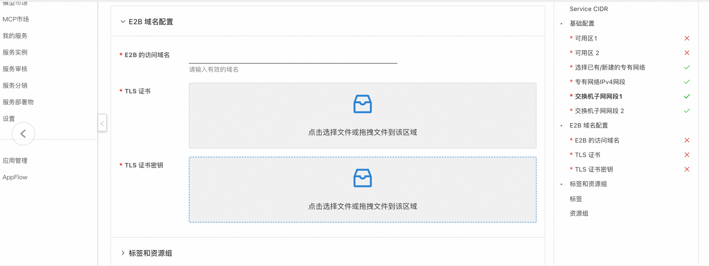

# 使用计算巢部署 Agent Sandbox

本指南介绍如何通过阿里云计算巢部署兼容 E2B 协议的 Agent Sandbox。您可以新建 ACS 集群、新建 ACK 集群，或把 Agent Sandbox 组件安装到已有 ACK 集群。完成部署后，您可以使用 E2B SDK 创建、运行、暂停和重新连接沙箱。

## 快速开始

完成以下步骤，即可获得可供 E2B SDK 使用的 Sandbox API 地址和访问密钥。

1. 根据账号站点打开[中国站部署页面](https://computenest.console.aliyun.com/service/instance/create/cn-hangzhou?type=user&ServiceId=service-47d7c54c78604e0bbe79)或[国际站部署页面](https://computenest.console.alibabacloud.com/service/instance/create/ap-southeast-1?type=user&ServiceId=service-7c3a2fa4dd3e46519c59)。
2. 选择 **ACS部署**、**ACK 部署**或**已有 ACK 部署**。
3. 配置网络、Sandbox 访问域名、TLS 证书和 API Key。
4. 确认费用并创建服务实例。
5. 等待实例状态变为**已部署**，然后在实例详情页获取 `E2B_DOMAIN` 和 `E2B_API_KEY`。新建 ACS/ACK 部署还会输出 `ALB_DNS_Name`。
6. 配置 DNS 后，运行[自动化验证](#automated-verification)或[本地 API 验证](#local-api-verification)。

## 选择部署方式

三种部署方式使用相同的 E2B 接入协议，但集群生命周期和前置条件不同。

| 部署方式 | 适用场景 | 计算巢创建的主要资源 | 需要您提前准备 |
| --- | --- | --- | --- |
| ACS 部署 | 希望免运维节点并按需使用容器算力 | ACS 集群、网络、ALB 和 Agent Sandbox 组件 | 域名和 TLS 证书 |
| ACK 部署 | 需要完整 Kubernetes 节点和集群配置 | ACK 集群、Worker 节点、网络、ALB 和 Agent Sandbox 组件 | 域名和 TLS 证书 |
| 已有 ACK 部署 | 希望复用现有 ACK 集群和 VPC | Agent Sandbox 组件、测试 Pod；缺少时安装 ALB Ingress Controller 和 `ack-virtual-node` | 可用的 ACK 集群、两个可用区的交换机、域名和 TLS 证书 |

如果没有必须复用的集群，建议选择 **ACS部署**。如果工作负载依赖节点级配置，选择 **ACK 部署**。只有在已确认现有集群组件版本和网络配置后，才选择**已有 ACK 部署**。

## 开始之前

开始部署前，请准备账号权限、域名和证书。选择已有 ACK 时，还必须检查目标集群组件。

### 开通云服务

首次部署时，计算巢会提示开通相关云服务并创建服务角色。此操作通常需要云产品管理员权限，而且每个账号只需执行一次。


您可以采用以下任一方式：

- 让管理员打开部署页面并按提示完成开通。
- 临时为部署所用的 RAM 用户授予开通权限，完成后及时回收高权限。

需要自定义权限时，请参考[首次开通服务权限策略](open_policy.json)。

### 为 RAM 用户授权 { #grant-ram-permissions }

如果您使用 RAM 用户部署，必须授予以下权限：

- `AliyunComputeNestUserFullAccess`：管理计算巢用户侧资源。
- `AliyunROSFullAccess`：管理资源编排服务（ROS）资源。
- [Agent Sandbox 自定义权限策略](policy.json)：管理模板涉及的其他云资源。

管理员可以参考[为 RAM 用户授权计算巢权限](https://help.aliyun.com/zh/compute-nest/security-and-compliance/grant-user-permissions-to-a-ram-user)完成授权。请按照最小权限原则管理生产账号。

### 准备域名和 TLS 证书

E2B 客户端通过 HTTPS 访问 Sandbox API。建议使用专用子域名，例如 `sandbox.example.com`，不要直接使用现有业务域名或公共父域。

证书必须覆盖以下域名：

- `sandbox.example.com`
- `*.sandbox.example.com`

生产环境必须使用受客户端信任的证书。仅在测试环境中，可以使用 [OpenKruise 证书生成脚本](https://github.com/openkruise/agents/blob/master/hack/generate-certificates.sh)创建自签名证书：

```bash
curl -O https://raw.githubusercontent.com/openkruise/agents/master/hack/generate-certificates.sh
chmod +x generate-certificates.sh
./generate-certificates.sh --domain sandbox.example.com --days 365
```

部署时会使用以下文件：

- `fullchain.pem`：上传到 **TLS 证书**。
- `privkey.pem`：上传到 **TLS 证书密钥**。
- `ca-fullchain.pem`：使用自签名证书从本地验证时，配置为客户端信任链。

私钥属于敏感信息。不要把 `privkey.pem` 提交到代码仓库，也不要通过聊天或工单传递。

### 检查已有 ACK 集群

如果选择**已有 ACK 部署**，必须先在 ACK 控制台的**运维管理 > 组件管理**中检查以下组件：

- `alb-ingress-controller`：可以未安装，也可以已安装且配置可用。未安装时，模板会自动安装并创建默认 `AlbConfig`；已安装时，模板保留现有组件和配置。
- `ack-virtual-node`：可以未安装，也可以是 `v2.17.0` 或更高版本。未安装时，模板会自动安装；如果版本低于 `v2.17.0`，必须先手动升级。

目标 VPC 还必须在两个不同可用区中各有一个可用于 ALB 的交换机。

## 创建服务实例

计算巢会根据您选择的部署方式显示对应参数。以下参数适用于中国站和国际站。

### 1. 打开部署页面

根据账号站点打开相应页面：

- [中国站 Agent Sandbox 部署页面](https://computenest.console.aliyun.com/service/instance/create/cn-hangzhou?type=user&ServiceId=service-47d7c54c78604e0bbe79)
- [国际站 Agent Sandbox 部署页面](https://computenest.console.alibabacloud.com/service/instance/create/ap-southeast-1?type=user&ServiceId=service-7c3a2fa4dd3e46519c59)

在页面顶部选择目标地域和部署方式。

### 2. 配置集群和网络

如果选择 **ACS部署**或**ACK 部署**，您可以新建 VPC，也可以选择现有 VPC。新建集群时请确保 VPC CIDR、交换机 CIDR 和 Kubernetes Service CIDR 不重叠。

如果选择**已有 ACK 部署**，请完成以下配置：

1. 选择目标 `ClusterId`。
2. 确认自动关联的 VPC 正确。
3. 选择 ALB 网络类型：`Internet` 表示公网，`Intranet` 表示内网。
4. 选择两个不同可用区，并分别选择同一 VPC 内的交换机。

ALB 网络类型只在模板需要安装 `alb-ingress-controller` 时生效。目标集群已安装该组件时，模板不会覆盖现有配置。

### 3. 配置 Sandbox

填写以下 Sandbox 参数：

| 参数 | 说明 | 建议 |
| --- | --- | --- |
| **Sandbox 访问域名** | E2B 客户端使用的基础域名 | 使用专用子域名，例如 `sandbox.example.com` |
| **TLS 证书** | PEM 格式的服务器证书链 | 上传 `fullchain.pem` |
| **TLS 证书密钥** | 与证书匹配的私钥 | 上传 `privkey.pem` |
| **Sandbox API 访问密钥** | 请求 Sandbox API 时使用 | 使用自动生成值，或输入独立的强密钥 |
| **Sandbox Manager CPU** | 管理组件的 CPU 核数 | 默认 `2`，按并发量调整 |
| **Sandbox Manager 内存** | 管理组件的内存 | 默认 `4Gi`，按并发量调整 |



### 4. 创建并等待部署完成

检查费用和资源配置后，单击**确认订单**。在计算巢控制台等待服务实例状态变为**已部署**。

部署完成后，在实例详情页记录以下输出：

| 输出 | 适用方式 | 用途 |
| --- | --- | --- |
| `E2B_DOMAIN` | 全部 | 配置 E2B SDK 的基础域名 |
| `E2B_API_KEY` | 全部 | 调用 Sandbox API 的访问密钥；页面会按敏感值处理 |
| `ALB_DNS_Name` | 新建 ACS/ACK | 配置公网或内网 DNS 的 CNAME 目标 |
| `ClusterId` | 全部 | 在 ACS 或 ACK 控制台定位集群 |
| 后续步骤 | 已有 ACK | 配置 Ingress HTTPS 监听和 DNS |

## 配置域名解析

部署完成后，必须让 API 域名及通配域名解析到 ALB 访问端点。新建 ACS/ACK 部署可直接使用输出的 `ALB_DNS_Name`。已有 ACK 部署必须先按实例输出的后续步骤配置 Ingress HTTPS 监听，再从 ACK 控制台获取 ALB 访问端点。生产环境建议使用 DNS CNAME 记录；临时测试可以配置本地 hosts。

### 生产环境 DNS

在 DNS 服务中至少创建以下记录，其中 `sandbox.example.com` 替换为部署时填写的域名：

| 主机记录 | 记录类型 | 记录值 |
| --- | --- | --- |
| `api.sandbox.example.com` | CNAME | 服务实例输出的 `ALB_DNS_Name` |
| `*.sandbox.example.com` | CNAME | 服务实例输出的 `ALB_DNS_Name` |

如果只允许 VPC 内访问，请使用 PrivateZone 创建相同记录，并把目标 ACK/ACS 集群所在 VPC 加入生效范围。使用现有业务域名时，PrivateZone 的权威解析可能影响该后缀在 VPC 内的其他记录，因此建议使用专用子域名。

已有 ACK 部署还需要根据服务实例输出中的后续步骤，确认 Ingress HTTPS 监听和证书配置已生效。

### 本地 hosts 验证

本地 hosts 只适合短期测试，而且无法直接表达通配记录。先解析 ALB 域名获得 IP，再添加所需主机名：

```bash
dig +short ALB_DNS_NAME
sudo sh -c 'printf "%s %s\n" "ALB_PUBLIC_IP" "api.sandbox.example.com" >> /etc/hosts'
```

将 `ALB_DNS_NAME` 和 `ALB_PUBLIC_IP` 替换为实际值。测试完成后，删除新增的 hosts 记录。

## 验证部署

您可以在集群内运行随服务部署的测试脚本，也可以从本地直接调用 Sandbox API。

### 自动化验证 { #automated-verification }

模板会在 `default` 命名空间创建 `acs-sandbox-test-pod`，并准备 `test_code.py`、`test_browser.py` 和 `test_desktop.py`。

1. 从服务实例详情页打开 ACS 或 ACK 控制台。
2. 进入目标集群的**工作负载 > 容器组**，选择 `default` 命名空间。
3. 找到 `acs-sandbox-test-pod`，进入容器终端。
4. 运行核心功能测试：

   ```bash
   cd /app
   python test_code.py
   ```

5. 根据需要运行浏览器或桌面沙箱测试：

   ```bash
   python test_browser.py
   python test_desktop.py
   ```

测试通过时，脚本会完成沙箱创建和代码执行等操作。测试 Pod 未进入 `Running` 时，请先查看 Pod 事件和容器日志。

### 本地 API 验证 { #local-api-verification }

设置服务实例输出，并调用创建沙箱接口。自签名证书需要把 `ca-fullchain.pem` 配置为信任链：

```bash
export E2B_DOMAIN='sandbox.example.com'
export E2B_API_KEY='e2b_replace_with_your_key'

curl --fail-with-body \
  --cacert ./ca-fullchain.pem \
  --request POST "https://api.${E2B_DOMAIN}/sandboxes" \
  --header 'Content-Type: application/json' \
  --header "X-API-Key: ${E2B_API_KEY}" \
  --data '{"templateID":"code-interpreter","timeout":300}'
```

成功响应包含 `sandboxID`，且 `state` 为 `running`。使用公有 CA 签发的证书时，可以省略 `--cacert`。

### 使用 E2B Python SDK

安装 SDK，并通过环境变量提供域名和密钥：

```bash
python3 -m pip install e2b-code-interpreter python-dotenv
export E2B_DOMAIN='sandbox.example.com'
export E2B_API_KEY='e2b_replace_with_your_key'
export SSL_CERT_FILE="$PWD/ca-fullchain.pem"
```

创建 `verify_sandbox.py`：

```python
from e2b_code_interpreter import Sandbox


def main() -> None:
    sandbox = Sandbox.create(template="code-interpreter", request_timeout=60)
    result = sandbox.commands.run("whoami")
    print(result.stdout.strip())
    sandbox.kill()


if __name__ == "__main__":
    main()
```

运行脚本：

```bash
python verify_sandbox.py
```

如果需要验证暂停和重新连接，请运行仓库中的 [`test_sandbox.py`](https://github.com/aliyun-computenest/quickstart-Sandbox-Manager-E2B/blob/main/test_sandbox.py)。该脚本仅用于测试，不要用于生产任务。

## 默认沙箱类型

新建 ACS 和新建 ACK 部署会创建多种预热池。已有 ACK 部署当前只创建代码解释器和桌面沙箱预热池。

| 模板 ID | 用途 | ACS / 新建 ACK | 已有 ACK |
| --- | --- | --- | --- |
| `sandbox` | 通用代码执行 | 支持 | 不创建 |
| `code-interpreter` | Python 代码解释器 | 支持 | 支持 |
| `browser` | 浏览器自动化 | 支持 | 不创建 |
| `desktop` | 桌面自动化 | 支持 | 支持 |
| `android` | Android 自动化 | 支持 | 不创建 |

如果您自行修改 SandboxSet，计划使用暂停和恢复功能时，不要添加 `livenessProbe` 或 `readinessProbe`。沙箱暂停期间，这些探针可能触发错误重启。

## 故障排查

以下问题覆盖部署和首次验证中最常见的失败场景。

| 现象 | 常见原因 | 处理方法 |
| --- | --- | --- |
| 部署页提示无权限或无法开通服务 | RAM 用户缺少计算巢、ROS 或云产品开通权限 | 让管理员完成首次开通，并按[权限章节](#grant-ram-permissions)授予最小权限 |
| 已有 ACK 部署在组件安装阶段失败 | `ack-virtual-node` 版本低于 `v2.17.0`，或现有 ALB 组件配置不可用 | 在 ACK 控制台升级组件或修复现有 `AlbConfig`，然后重新部署 |
| `acs-sandbox-test-pod` 处于 `ImagePullBackOff` | VPC 无法访问镜像仓库，或网络出口配置不完整 | 检查 VPC、SNAT 和镜像仓库的网络连通性，并查看 Pod 事件 |
| API 返回 `401` 或 `403` | `E2B_API_KEY` 不正确 | 从服务实例详情页重新复制密钥，并检查环境变量中是否包含多余空格 |
| TLS 校验失败 | 证书未覆盖 API/通配域名，或客户端不信任自签名 CA | 检查证书 SAN；测试环境设置 `SSL_CERT_FILE` 或 `--cacert`，生产环境使用受信任证书 |
| API 域名无法解析 | `api` 或通配 CNAME 未创建，或 PrivateZone 未关联目标 VPC | 检查 DNS 记录、ALB 地址类型和 PrivateZone 生效范围 |
| 沙箱暂停后被重新创建 | 自定义 SandboxSet 配置了存活或就绪探针 | 移除 `livenessProbe` 和 `readinessProbe` 后重新应用 SandboxSet |

仍无法定位问题时，请保存服务实例 ID、失败资源名称和错误信息；不要在工单中粘贴 API Key、TLS 私钥或其他凭证。

## 后续步骤

部署验证通过后，建议完成以下生产化工作：

- 使用公有 CA 签发的证书替换测试证书。
- 把 `E2B_API_KEY` 存入密钥管理服务，不要写入代码或镜像。
- 根据并发量调整 Sandbox Manager 和预热池资源。
- 为 ALB、Sandbox Manager 和集群资源配置监控与告警。
- 评估网络访问范围，仅在需要时开放公网 ALB。

For English instructions, see the [English deployment guide](index-en.md).
